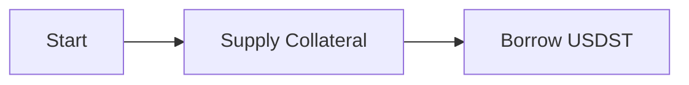

# Documentation Improvement Skill

Analyze and improve documentation in the STRATO platform repository with focus on clarity, technical accuracy, completeness, and user experience.

## Documentation Structure Context

All documentation is in `/techdocs` and published to https://docs.strato.nexus (MkDocs Material theme).

The documentation is organized by audience and depth:

### User Documentation
- **Location:** `techdocs/guides/`, `techdocs/scenarios/`
- **Audience:** End users performing DeFi operations
- **Tone:** Tutorial-focused, workflow-based, beginner-friendly
- **Style:** Conversational, step-by-step, with real examples and numbers

### Developer Documentation
- **Location:** `techdocs/build-apps/`, `techdocs/reference/`
- **Audience:** External developers building apps on STRATO
- **Tone:** API-focused, integration-oriented
- **Style:** Technical but accessible, code examples, REST API specs

### Technical Documentation
- **Location:** `techdocs/technical/`
- **Audience:** Core platform developers, contributors
- **Tone:** Implementation-focused, specification-level
- **Content:** Design docs, detailed architecture, smart contract formulas, test plans
- **Style:** Technical, precise, formula-heavy

### Contributor Documentation
- **Location:** `techdocs/contribute/`
- **Audience:** Platform contributors
- **Content:** Setup guides, architecture overview, contribution guidelines

## What to Do When Invoked

When the user runs `/improve-docs [file-path]` or `/improve-docs [directory]`:

1. **Read the Target Documentation**
   - Use Read tool to load the specified file(s)
   - If a directory is specified, use Glob to find all `.md` files
   - Determine audience level from path: `guides/` or `scenarios/` (users), `build-apps/` or `reference/` (developers), `technical/` (core devs), `contribute/` (contributors)

2. **Analyze Against Appropriate Standards**

   **For User Docs (`guides/`, `scenarios/`):**
   - ✅ **Clarity:** Is it understandable for non-experts?
   - ✅ **Completeness:** Are there worked examples with real numbers?
   - ✅ **User Journey:** Does it guide users step-by-step?
   - ✅ **Safety Warnings:** Are risks and liquidation scenarios explained?
   - ✅ **Visual Aids:** Could diagrams/tables improve understanding?
   - ✅ **Links:** Are related guides cross-referenced?
   - ✅ **Action-Oriented:** Are UI paths clear ("Click X → Select Y")?
   - ✅ **Consistency:** Does it match the tone/style of other guides?

   **For Developer Docs (`build-apps/`, `reference/`):**
   - ✅ **API Accuracy:** Do endpoints, parameters match actual API?
   - ✅ **Code Examples:** Are snippets complete and runnable?
   - ✅ **Integration Clarity:** Is the integration path clear?
   - ✅ **Authentication:** Are auth requirements explained?
   - ✅ **Error Handling:** Are error codes documented?

   **For Technical Docs (`technical/`):**
   - ✅ **Technical Accuracy:** Are formulas, configs, and specs correct?
   - ✅ **Completeness:** Are all contract methods/API endpoints documented?
   - ✅ **Precision:** Are data types, units, and ranges specified?
   - ✅ **Implementation Details:** Are edge cases and error handling covered?
   - ✅ **Code Examples:** Are code snippets syntactically correct?
   - ✅ **References:** Are related system components linked?

3. **Check Common Issues**
   - Broken internal links (check if referenced files exist)
   - Inconsistent terminology (e.g., "USDST" vs "usdst")
   - Missing code blocks formatting
   - Outdated version numbers or URLs
   - Ambiguous pronouns ("it", "this", "that" without clear antecedent)
   - Wall-of-text paragraphs (suggest breaking up with headings/lists)
   - Missing prerequisites or setup steps
   - Unexplained jargon or acronyms

4. **Verify Technical Accuracy**
   - Cross-reference API endpoints with Swagger spec if mentioned
   - Check contract addresses match those in `/mercata/contracts` or configs
   - Verify formulas against source code if possible
   - Validate example commands/code snippets
   - Ensure OAuth flows match actual Keycloak implementation

5. **Suggest Specific Improvements**
   - Provide concrete before/after examples
   - Prioritize high-impact changes (clarity > style)
   - Respect the target audience's level
   - Maintain consistency with existing documentation style
   - Suggest where to add:
     - Mermaid diagrams for workflows
     - Admonition blocks (!!!tip, !!!warning, !!!danger)
     - Tables for comparing options
     - Real-world scenarios with actual numbers

6. **Output Format**

   Present findings as:

   ```markdown
   ## Documentation Review: [filename]

   **Type:** [Public User Guide / Internal Technical Spec]
   **Audience:** [End Users / Developers / Contributors]

   ### Overall Assessment
   [2-3 sentence summary of doc quality]

   ### Critical Issues (Fix Immediately)
   - [ ] Issue 1 with specific line reference
   - [ ] Issue 2 with specific line reference

   ### Improvements (High Impact)
   1. **[Section Name]** (lines X-Y)
      - Problem: [What's unclear/missing/wrong]
      - Suggestion: [Specific improvement]
      - Example: [Before/after if applicable]

   ### Enhancements (Nice to Have)
   - Suggestion 1
   - Suggestion 2

   ### Strengths
   - What's already done well

   ### Cross-References to Add
   - Link to [related-doc.md] in section X
   - Reference [contract/file] for implementation details
   ```

7. **If User Approves, Apply Edits**
   - Ask which improvements to apply
   - Use Edit tool to make changes
   - Preserve existing formatting and tone
   - Add comments in commits explaining changes

## Examples

### Example 1: Improve User Guide

**User:** `/improve-docs techdocs/guides/borrow.md`

**Action:**
1. Read `techdocs/guides/borrow.md`
2. Check for:
   - Clear step-by-step instructions
   - Real numbers in examples (not "some USDST")
   - Health factor warnings
   - Liquidation risk explanation
   - Links to related guides (mint-cdp, manage-collateral)
3. Verify technical accuracy against lending API
4. Suggest adding Mermaid diagram for borrow flow
5. Check if Swagger reference link works

### Example 2: Review Technical Specification

**User:** `/improve-docs techdocs/technical/api-specs/lending-spec.md`

**Action:**
1. Read `techdocs/technical/api-specs/lending-spec.md`
2. Check formulas for correctness
3. Verify all contract methods are documented
4. Compare with actual smart contract source if accessible
5. Check parameter types and return values
6. Ensure error codes are complete
7. Verify against lending test plan

### Example 3: Batch Review

**User:** `/improve-docs techdocs/scenarios/`

**Action:**
1. Glob all .md files in scenarios/
2. Check consistency across scenarios
3. Verify all scenarios follow same structure
4. Check cross-references between scenarios
5. Ensure risk warnings are present
6. Validate that numbers/examples are realistic

## Guidelines

### Tone Matching

**For User Docs (`guides/`, `scenarios/`):**
- Use second person ("you")
- Active voice
- Conversational but professional
- Explain "why" not just "what"
- Add encouragement ("Great! Now you can...")

**For Developer Docs (`build-apps/`, `reference/`):**
- Clear, direct technical writing
- Code-focused with working examples
- Assume technical background

**For Technical Docs (`technical/`):**
- Technical precision over readability
- Passive voice acceptable for specs
- Mathematical notation is expected
- Implementation details are critical

### MkDocs-Specific Features

When improving `/techdocs`, leverage MkDocs Material features:

```markdown
!!! tip "Pro Tip"
    Use this for helpful hints

!!! warning "Liquidation Risk"
    Use this for important warnings

!!! danger "Critical"
    Use this for dangerous actions

???+ note "Click to expand"
    Use this for optional details



### Link Validation

Always check:
- Internal links: `[text](../other-doc.md)`
- Anchors: `[text](file.md#section-name)`
- External URLs: Verify domain is accessible
- Code references: `src/file.ts:123`

### Version Sensitivity

Be cautious with:
- API version numbers (v1, v2)
- Contract addresses (testnet vs mainnet)
- Node versions in setup guides
- Deprecated features marked clearly

## Technical Accuracy Checks

### For DeFi/Financial Content

- [ ] Health factor formulas are correct
- [ ] Liquidation thresholds are accurate
- [ ] APR/APY calculations are right
- [ ] Gas cost estimates are realistic
- [ ] Token decimals are specified (18 for most ERC20)
- [ ] Price oracle references are clear

### For API Documentation

- [ ] Endpoint paths match Swagger spec
- [ ] HTTP methods are correct (GET/POST/PUT/DELETE)
- [ ] Request/response examples are valid JSON
- [ ] Auth requirements are stated
- [ ] Error codes are documented
- [ ] Rate limits are mentioned

### For Architecture Docs

- [ ] Component diagrams match actual system
- [ ] Service ports are correct
- [ ] Technology versions are current
- [ ] Data flow directions are accurate
- [ ] Dependencies are complete

## When NOT to Change

Do NOT modify:
- Mathematical formulas without verifying against source code
- Contract addresses without confirmation
- API endpoints without checking Swagger spec
- Code examples without testing them
- Version numbers without verifying current version

## Output Priority

1. **Critical Issues** - Broken links, wrong information, security risks
2. **High Impact** - Clarity improvements, missing examples, unclear steps
3. **Enhancements** - Better formatting, additional diagrams, style consistency
4. **Nice to Have** - Wording tweaks, minor formatting

---

## Usage

```bash
# Review a user guide
/improve-docs techdocs/guides/borrow.md

# Review all scenarios
/improve-docs techdocs/scenarios/

# Review technical specification
/improve-docs techdocs/technical/architecture/infrastructure.md

# Review all technical docs
/improve-docs techdocs/technical/

# Review developer integration guide
/improve-docs techdocs/build-apps/integration.md
```

After analysis, I will present findings and ask which improvements you'd like me to apply.
