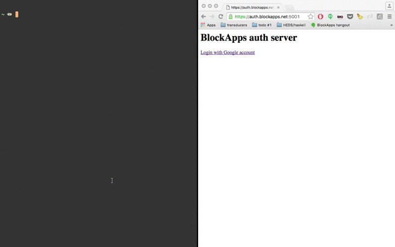

# registry and auth server

1. For security, we don't include the SSL certs here. Get hold of them and add them accordingly:
  - create a directory `auth_server/ssl/` and copy the certs to it:
    - certificate: "ssl/server.pem"
    - key: "ssl/server.key"
  - _note that you need to point the DNS for which your certs are valid to the IP address of the server you are running this docker instance on_.

2. run `docker-compose up`

3. run `docker login <hostname>:5000`
  - you can either login with `blockapps`
  - or with auth using your email, you can open `<hostname>:5001/google_auth` to login using google as per the video below: 
