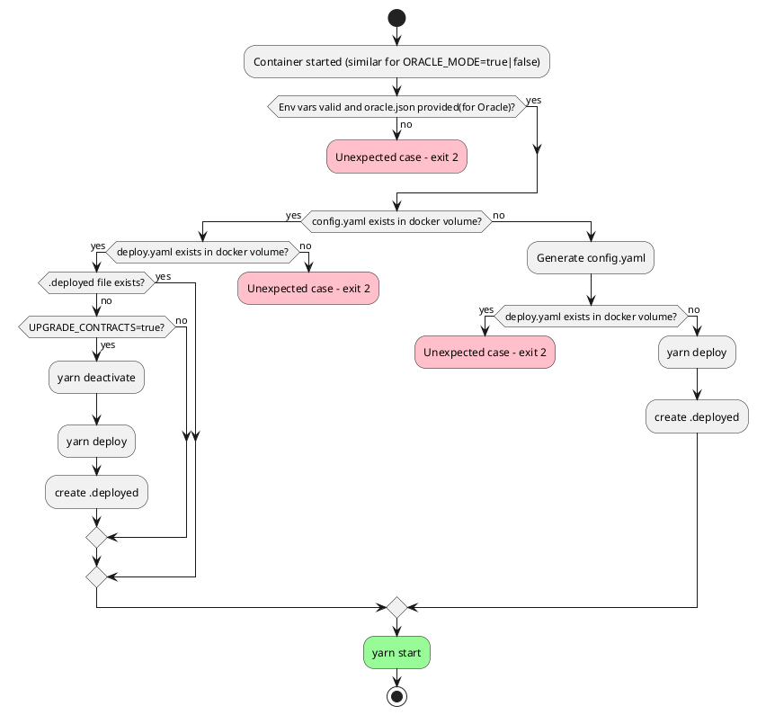

# Payment Server (CREDIT CARD/ACH)

Official BlockApps Credit Card and ACH Payment Server | Powered by Stripe

## PlantUML for docker-run.sh
Paste the following to planttext.com to see the sequence diagram of docker-run.sh logic

## Endpoints

##### GET `/ping`
Lets you play a full game of ping pong with Fan ZhenDong, one of the top table tennis players in the world.

---
### Redemption Endpoints

##### GET `/redemption/outgoing/:commonName`
**Returns** a list of outgoing redemption requests for a given `commonName`.

##### GET `/redemption/incoming/:commonName`
**Returns** a list of incoming redemption requests for a given `commonName`.

##### POST `/redemption/create`
Create a new redemption request.
```
{
  redemption_id: number,
  quantity: number,
  ownerComments: string,
  issuerComments: string,
  ownerCommonName: string,
  issuerCommonName: string,
  assetAddresses: string[],
  assetName: string,
  status: 1,
  shippingAddressId: number
}
```
**Returns** the `redemptionId` of the new request.

##### GET `/redemption/:id`
**Returns** the redemption request associated with the given `id`.

##### DELETE `/redemption/id/:id`
Delete a redemption request associated with the given `id`.
**Returns** the count of rows deleted.

##### PUT `/redemption/close/:id`
Close a redemption request associated with the given `id` and update the issuer comment field.
```
{
  issuerComments: string,
  status: 2 or 3
}
```
**Returns** the count of rows changed.

---
### Customer Endpoints

##### GET `/customer/address/:commonName`
**Returns** a list of addresses associated with the given `commonName`.

##### POST `/customer/address`
Add an address using the following information from the JSON body:
```
{
  commonName: string,
  name: string,
  zipcode: string,
  state: string,
  city: string,
  addressLine1: string,
  addressLine2: string optional,
  country: string
}
```
**Returns** the `id` of the newly added address in the table.

##### GET `/customer/address/id/:id`
Gets an address given the table `id` of the address. 
**Returns** the address in the `data` field of the response.

##### DELETE `/customer/address/id/:id`
Deletes an address given the table `id` of the address.  
**Returns** the number of `changes` made after the deletion.

---
### Stripe Endpoints

##### GET `/stripe/onboard?:username&:redirectUrl`
Onboard a user, `username` and `redirectUrl` required.  
**Returns** a redirect to the Stripe hosted connect link for the user.

##### GET `/stripe/status?:username`
Get the status of a stripe account given the `username` as a parameter.  
**Returns** the status of `chargesEnabled`, `detailsSubmitted`, and `payoutsEnabled` of the Stripe account.

##### GET `/stripe/checkout?:token&:redirectUrl`
Create and redirect to a Stripe hosted checkout session given the token of the order and a redirect back to the Marketplace.  
**Returns** a redirect to the Stripe checkout session for the provided order.

##### GET `/stripe/checkout/confirm?:token&:redirectUrl`
Confirms the payment of the order associated with the given token and performs the onchain transfer of the assets.  
**Returns** a redirect back to the Marketplace (redirectUrl) along with the list of assets that were transferred.

##### GET `/stripe/checkout/cancel?:token&:redirectUrl`
Cancels the order associated with the given token.  
**Returns** a redirect back to the Martkeplace (redirectUrl).

##### GET `/stripe/order/status?:tokens`
Get the most recent statuses of the orders associated with a given list of tokens.  
**Returns** a key/value pair of token to payment status.

## Dependencies

1. Docker Engine v24+ (For dockerized deployment)
2. Docker Compose V2
3. NodeJS 14+

*NOTE*  
Report and update dependencies if needed.

## Running

The server **requires** the following environmental variables to run in non-dockerized mode:
```
`STRIPE_SECRET_KEY` for Stripe API
`STRIPE_CONTRACT_ADDRESS` to the Stripe ExternalPaymentService contract
`METAMASK_CONTRACT_ADDRESS` to the MetaMask ExternalPaymentService contract

-- Optional --
`POSTGRES_SERVER_URL`
`POSTGRES_PORT`
`POSTGRES_USER`
`POSTGRES_PASSWORD`
`POSTGRES_DBNAME`

```

If running non-dockerized, use `npm run start` or `npm run dev`.  
If running dockerized, provide a `docker-compose.payment-server.yml` file and use `docker-compose -f docker-compose.payment-server.yml up -d --remove-orphans`.

## Script
To manually run the script below, first copy the necessary config files by running:
```
cp /config/config.yaml config.yaml
cp /config/deploy.yaml config/deploy.yaml
```

To offboard a seller, run the following command:
```
SELLER_NAME="sellerCommonName" yarn offboard
```

## Testing

The payment server uses `jest` as its testing framework. In order to run the tests, the following environment variables should be available:
```
<!-- REQUIRED ENV -->
`STRIPE_SECRET_KEY` for Stripe API
`STRIPE_CONTRACT_ADDRESS` to the Stripe ExternalPaymentService contract
`METAMASK_CONTRACT_ADDRESS` to the MetaMask ExternalPaymentService contract
`TEST_MODE` = 'true'

-- Optional --
`POSTGRES_SERVER_URL`
`POSTGRES_PORT`
`POSTGRES_USER`
`POSTGRES_PASSWORD`
`POSTGRES_DBNAME`
```

**It is highly recommended to use a separate database for testing purposes**. Afterwards, simply run `npm run test`.

# Oracle Container Guide

## Overview
This document provides a comprehensive guide to starting the oracle container. The oracle container is responsible for the creation and deactivation of the Oracle contracts as well as updating the oracle price.

## About the Container
The oracle container runs on the `mercata-testnet2-payments` and `mercata-payments` virtual machines, which are accessible via SSH (granted by the DevOps team). Once logged into these VMs, you can view the running docker containers using:

```sh
sudo docker ps
```

On the test network, the container should appear as oracle_oracle_1 and on the production network as oracle-oracle-1.

The two key files required to run the oracle container are:
	•	docker-compose.oracle.yml: The docker compose file that defines the Oracle service.
	•	run-oracle.sh: The shell script that starts the oracle container.

Both files are located in the strato-getting-started directory:
```sh
cd /datadrive/testnet2/strato-getting-started   # For test network
cd /datadrive/prod/strato-getting-started         # For production network
```

The docker-compose.oracle.yml file is typically obtained from the Jenkins build of a specific branch, while the run-oracle.sh script is maintained in the same directory.

Key Environment Variables

Before starting the container, ensure that the following non-network-related environment variables are set:
```sh
	•	BASE_CODE_COLLECTION: Sets the oracle version.
	•	METALS_API_KEY: API key for fetching metal prices from metals.dev.
	•	ALCHEMY_API_KEY: API key for fetching ERC20 token prices from Alchemy.
	•	UPGRADE_ORACLE_CONTRACTS: Flag that instructs the docker script to deactivate old contracts and create new ones.
```
Note: Even with this flag, the oracle_config.yaml file is not updated if it already exists. Please consult the DevOps team for further details.

Additionally, the oracle container requires an oracle.json file to start:
	•	oracle.json: This file, generated from template.oracle.json (located in the root of the payment-server directory), contains details about the oracles that will be deployed and the assets whose sale prices need updating.

Running the Container

Preparing the Docker Compose File
1.	Navigate to the strato-getting-started directory:
```sh
cd /datadrive/testnet2/strato-getting-started   # or /datadrive/prod/strato-getting-started
```

2.	Backup and update the docker-compose.oracle.yml file: (Back up the existing file.)

```sh
nano docker-compose.oracle.yml
```


Replace its contents with the desired Jenkins build version.

Starting the Oracle Container

Before launching, verify that:
	•	The run-oracle.sh script has the correct environment variables.
	•	The oracle.json file is present and correctly configured with all required oracle and asset details.
	•	If deploying new oracles, ensure that oracle.json includes the new details and that UPGRADE_ORACLE_CONTRACTS is set to true.

To start the container, execute:
```sh
sudo ./run-oracle.sh
```

Viewing Container Logs

To view the logs of the running container, use:
```sh
sudo docker logs -f <container_name>
```
Replace <container_name> with the actual container name (e.g., oracle_oracle_1 or oracle-oracle-1).

Post-Deployment Steps

If you set UPGRADE_ORACLE_CONTRACTS to true to deploy new oracles:
	•	Use the newly deployed oracles to update existing reserves using the script located at marketplace/backend/config/update-reserve-oracle.
	•	The required environment variables for running this script are in the same directory.

Additional Considerations
	•	Environment Variables:
After a contract upgrade, remove the UPGRADE_ORACLE_CONTRACTS flag from the run-oracle.sh script once the container is running. This helps prevent accidental redeployments by nightly builds or developers.
	•	Configuration File Updates:
Changes to the oracle_config.yaml file or its variable values must be made manually. Container restarts do not automatically update this file.
To edit the file:
1.	Enter the container:
```
sudo docker exec -it <container_name> sh
```


2.	Use an editor like vi to modify /config/oracle_config.yaml.

PlantUML Sequence Diagram for Oracle Container Logic

To visualize the sequence diagram of the Oracle container startup process, paste the following code into PlantText:
```plantuml
@startuml
start
:Container started (ORACLE_MODE=true);
if (oracle.json exists in /mnt?) then (yes)
  :Copy oracle.json to /tmp;
  :Set oracle.json permissions to read-only;
else (no)
  #pink:Error: oracle.json not found; exit
  stop
endif
if (Required env vars set? (METALS_API_KEY, ALCHEMY_API_KEY, ...)) then (yes)
else (no)
  #pink:Missing env vars; exit
  stop
endif
if (oracle_config.yaml exists in /config?) then (yes)
  if (oracle_deploy.yaml exists?) then (yes)
    if (.deploy_attempted flag exists?) then (continue)
    else
      if (UPGRADE_ORACLE_CONTRACTS=true?) then (yes)
        :yarn deactivate-oracle;
        :yarn deploy-oracle;
        :Create .deploy_attempted flag;
      endif
    endif
  else (no)
    if (SKIP_ORACLE_DEPLOYMENT != true?) then (yes)
      :Generate oracle_config.yaml from template;
      :Create .deploy_attempted flag;
      :yarn deploy-oracle;
    else (no)
      :Skip oracle deployment;
    endif
  endif
else (no)
  :Generate oracle_config.yaml from template;
  if (oracle_deploy.yaml exists?) then (error)
    #pink:Error: oracle_deploy.yaml exists without config; exit
    stop
  else (no)
    if (SKIP_ORACLE_DEPLOYMENT != true?) then (yes)
      :Create .deploy_attempted flag;
      :yarn deploy-oracle;
    else (no)
      :Skip oracle deployment;
    endif
  endif
endif
:Start submit-price script;
stop
@enduml
```
## Summary

- **Purpose:** The Oracle container manages oracle contracts and updates prices.
- **Setup:** Ensure all required files and environment variables are correctly set.
- **Deployment:** Use the run-oracle.sh script to start the container and monitor its logs.
- **Post-Deployment:** Update reserves as needed and remove the upgrade flag to prevent accidental redeployments.

For further assistance or more detailed instructions, please contact your DevOps team.

This Markdown file (e.g., `README.md`) provides a comprehensive guide for developers and DevOps engineers to start, manage, and troubleshoot the Oracle container.