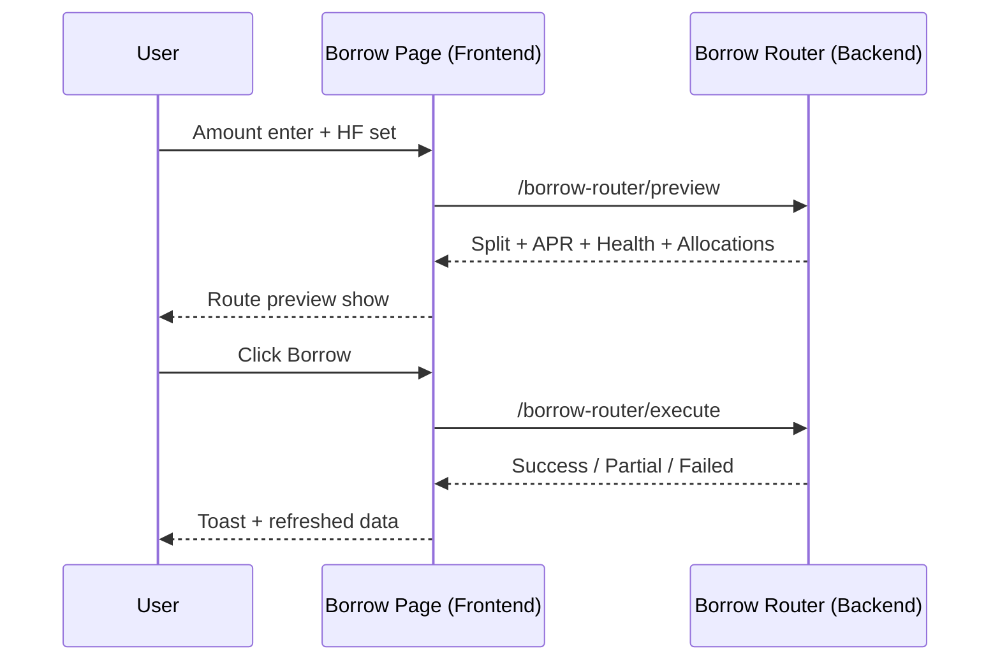
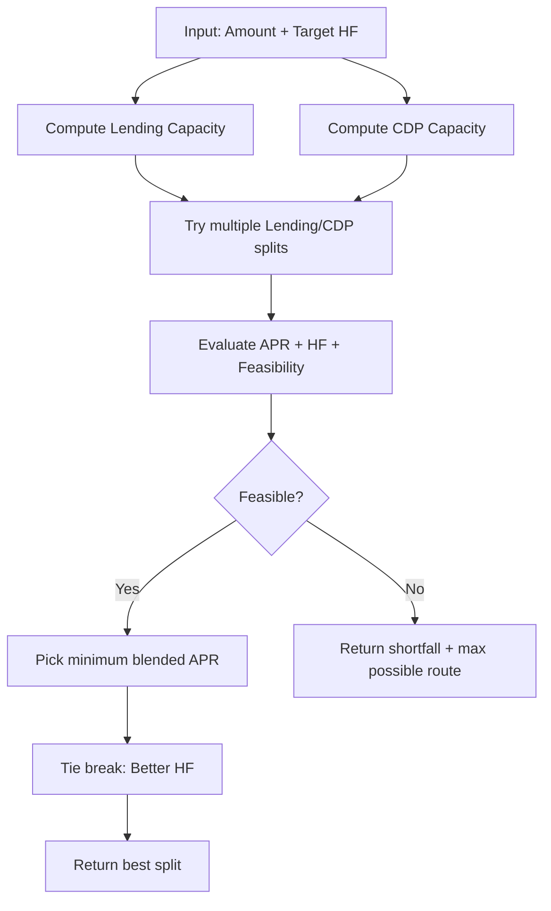
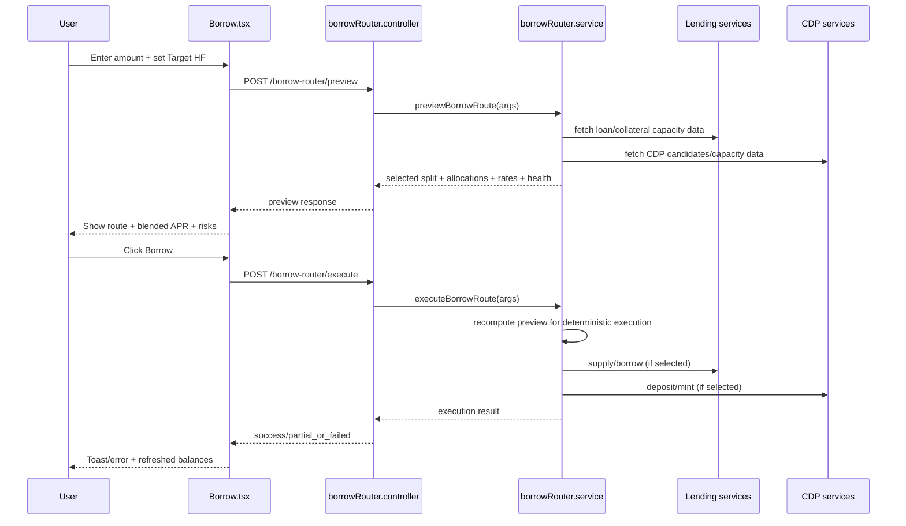
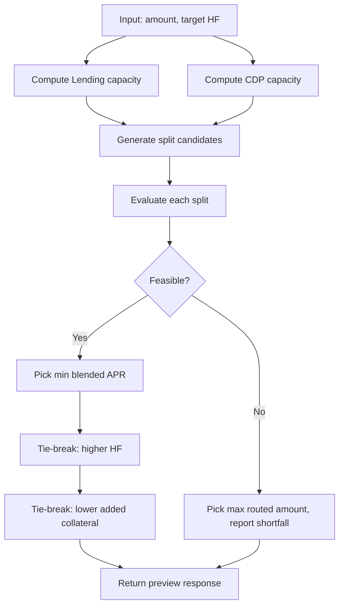

# Borrow Page Full Flow (Hinglish, Beginner Friendly)

 user `USDST` borrow karta hai, system decide karta hai kitna Lending se aur kitna CDP se lena hai, taaki rate best aaye aur risk control me rahe.

---

## 1) Borrow page karta kya hai?

Jab user Borrow page pe aata hai:

1. User amount dalta hai (example: `1000` ya `140000` USDST).
2. User risk slider se target HF set karta hai (example: `2.1x`).
3. System backend se puchta hai:
   - Is amount ke liye best route kya hai?
   - Lending kitna use hoga?
   - CDP kitna use hoga?
   - Blended APR kitna banega?
4. UI live update hota hai.
5. User Borrow button press karta hai.
6. Backend route execute karta hai.

**User amount + risk deta hai -> system best split nikalta hai -> user borrow execute karta hai.**

---

## 2) Important words (easy definitions)

- **Borrow Amount**: User ko kitna USDST chahiye.
- **Lending Route**: Lending pool se borrow lena.
- **CDP Route**: Vault ke against mint karna.
- **Split**: Total borrow ko 2 parts me todna (Lending + CDP).
- **Blended APR**: Dono routes ka weighted average rate.
- **HF (Health Factor)**: Position kitni safe hai (zyada HF = zyada safe).
- **Target HF**: User slider se set karta hai.
- **Projected HF**: Backend bolta hai ki current route ke baad HF kitna hoga.
- **Additional Collateral Used**: Is operation me naya collateral kitna add hua.
- **Total Borrow Routed**: Borrow ka total routed amount (Lending + CDP).

---

## 3) Frontend ka real flow (step by step)

Main file: `ui/src/pages/Borrow.tsx`

### Step A: Page load hoti hai

Frontend background me data load karta hai:

- lending collateral data
- CDP vault data
- loans/balances

Agar ek source slow ya fail ho:
- jo source ready hai woh show hota hai
- dusre pe loading/error state dikhti hai

Isliye page blank nahi hota.

### Step B: User amount type karta hai

Jaise hi amount change:
- value sanitize hoti hai
- preview API call trigger hoti hai (debounce ke sath)

Debounce ka matlab:
- har keypress pe API hit nahi karega
- thoda wait karke latest input ke sath call karega

### Step C: User HF slider move karta hai

Slider se `targetHealthFactor` update hota hai.
Phir preview API dobara call hoti hai.

### Step D: Preview API response aata hai

API batati hai:
- feasible hai ya nahi
- shortfall hai ya nahi
- lending split
- CDP split
- blended APR
- health metrics
- allocations

UI phir in numbers ko cards me render karti hai.

### Step E: User Borrow press karta hai

Frontend:
- checks: amount > 0, amount max capacity ke andar, preview feasible
- then `execute` API call

Backend execution ke baad:
- success ya partial fail message
- loans/collateral/vaults refresh

---

## 4) Backend ka flow (simple logic)

Main service: `backend/src/api/services/borrowRouter.service.ts`

Controllers:
- `POST /borrow-router/preview`
- `POST /borrow-router/execute`

### Preview me backend kya karta hai?

1. Current lending state nikalta hai.
2. Current CDP candidates nikalta hai (existing + potential).
3. Target HF ke against capacities nikalta hai.
4. Different split combinations test karta hai.
5. Har split ke liye calculate:
   - feasible?
   - blended APR
   - HF
   - projected LTV/liquidation info
6. Best split select karta hai:
   - pehle lowest APR
   - tie ho to better HF
   - phir lower additional collateral preference
7. Final preview response bhejta hai.

### Execute me backend kya karta hai?

1. Safety ke liye preview logic phir se run.
2. Steps execute:
   - lending supply (if needed)
   - lending borrow (if selected)
   - CDP deposit/mint (if selected)
3. Step-by-step status return karta hai.

---

## 5) Diagram 1: User to Backend flow

---

## 6) Diagram 2: Split decision logic

---

## 7) Real examples (easy)

### Example 1: Chhota amount, CDP cheap

Input:
- Borrow `1000 USDST`
- HF `2.1x`
- CDP fee low

Expected:
- Mostly ya fully CDP route
- blended APR close to CDP
- additional collateral zero ho sakta hai agar existing vault headroom enough hai

### Example 2: Bada amount, mixed route

Input:
- Borrow `140,552.07 USDST`
- HF `2.1x`

Possible output:
- Lending: `66,717.83`
- CDP: `73,834.24`
- Blended APR: `~3.42%`

Meaning:
- System ne total amount ko split kiya, taaki rate + risk best balance me rahe.

### Example 3: Amount capacity se bahar

If request too high:
- `feasible = false`
- `shortfall` milega
- UI error dega: insufficient routed capacity

---

## 8) UI me confusion kahan hoti hai (aur kyun)

Ye section important hai kyunki yahin regression repeat hota tha.

### Confusion 1: Route card kuch aur, collateral list kuch aur

Reason:
- route card borrow split dikhata hai
- collateral list additional/new collateral logic pe render ho sakti hai

Fix approach:
- labels clear rakho:
  - `Total additional collateral used`
  - `Total borrow routed`

### Confusion 2: CDP mint ho raha hai but "additional used = 0"

Reason:
- mint existing vault headroom se ho sakta hai
- naya deposit zero ho sakta hai

Ye valid state hai, bug nahi.

### Confusion 3: Slider move pe values lag karta hua lagta hai

Reason:
- debounce + in-flight preview

UI me `Updating...` states isi liye use kiye jate hain.

---

## 9) End-to-end feature list (one by one)

1. Amount input + preset buttons
2. Auto allocation toggle
3. Lending + CDP collateral source list
4. Independent loading/error per source
5. Live route preview
6. Target HF slider
7. Target HF vs Projected HF display
8. Blended APR + LTV + liquidation preview cards
9. Route breakdown card with mechanism split
10. Borrow execute with partial failure handling
11. Repay + repay-all flow

---

## 10) Test checklist (dev/test/prod)

### Dev
- Small amount test (CDP-heavy)
- Large amount test (mixed split)
- Slider move test
- Preview loading/error test

### Test/Staging
- One source down (lending or cdp) test
- infeasible borrow shortfall test
- execute partial failure message test

### Prod
- Monitor preview latency
- Monitor execute fail ratio
- Verify labels still match behavior

---

## 11) Important code map

- Frontend page: `ui/src/pages/Borrow.tsx`
- Frontend route: `ui/src/App.tsx` (`/dashboard/borrow`)
- Backend controller: `backend/src/api/controllers/borrowRouter.controller.ts`
- Backend logic: `backend/src/api/services/borrowRouter.service.ts`
- Lending context: `ui/src/context/LendingContext.tsx`

---

## 12) One-line summary (super beginner)

**Borrow page me user amount + risk deta hai, backend best Lending/CDP mix nikalta hai, frontend preview dikhata hai, aur execute pe wahi plan safely run hota hai.**

# Borrow Page: End-to-End Flow (Frontend -> Backend)

## 1) Purpose

`/dashboard/borrow` lets a user borrow `USDST` using a blended route across:
- Lending pool borrow
- CDP mint

The page continuously previews the best route for a chosen borrow amount and target Health Factor (HF), then executes that route.

---

## 2) Key Definitions

- **Borrow Amount**: Target `USDST` user wants to receive.
- **Target HF (Health Factor)**: Risk target selected by slider.
- **Projected HF**: HF returned by backend preview for current route.
- **Lending Allocation**: Additional collateral to supply into lending for the routed lending borrow amount.
- **CDP Allocation**: CDP mint plan for a collateral asset (existing vault collateral and/or fresh deposit).
- **Blended APR**: Weighted APR from Lending APR and CDP fee/APR by routed amount.
- **Additional Collateral Used**: New collateral added for this operation only:
  - Lending: `lendingAllocations.collateralValueUSD`
  - CDP: `cdpAllocations.depositCollateralValueUSD`
- **Borrow Routed**: Borrow split itself:
  - `split.lendingAmount + split.cdpAmount`

---

## 3) User-Facing Features on Borrow Page

1. Amount input (`USDST`) with quick presets (25/50/75/Max).
2. Auto-allocate collateral mode (default) and manual collateral mode.
3. Collateral source list (`Lending + CDP`) with source labels.
4. Risk slider to choose target HF.
5. Route preview card:
   - Lending amount
   - CDP amount
   - blended APR
   - reason and capacity context
6. Borrow execute action (`/borrow-router/execute`).
7. Repay panel (same page) for repay/repay-all.

---

## 4) Frontend Data Flow

Main file: `ui/src/pages/Borrow.tsx`

### 4.1 Initial data load

On logged-in load:
- `refreshLoans()`
- `refreshCollateral()`
- `GET /cdp/vaults`
- `fetchUsdstBalance()`

Status flags:
- `lendingCollateralStatus`: `idle | loading | success | error`
- `cdpVaultsStatus`: `idle | loading | success | error`

UI behavior:
- One source fails -> other source still shown.
- Loading skeletons shown independently per source.

### 4.2 Preview loop

Whenever any of these changes:
- borrow amount
- target HF
- manual lending collateral payload (manual mode)

frontend debounces and calls:
- `POST /borrow-router/preview`

Request payload:
- `amount` (wei string)
- `targetHealthFactor` (number)
- `lendingCollateral` (array; used in manual mode)

Preview states:
- `previewPending`: first load, no preview data yet
- `previewRefreshing`: loading with potentially previous preview shown

### 4.3 Render model (current semantics)

In preview mode:
- Collateral rows are route-driven.
- Lending rows come from `lendingAllocations` where `supplyAmount > 0`.
- CDP rows come from `cdpAllocations` where `mintAmount > 0`.
- If route has lending borrow but no new lending supply needed, a synthetic lending row is shown:
  - "No new supply required"
  - "Using existing lending collateral capacity"

Summary lines:
- `Total additional collateral used`
- `Total borrow routed`

---

## 5) Backend Preview Logic

Main service: `backend/src/api/services/borrowRouter.service.ts`

Controller:
- `POST /borrow-router/preview` -> `previewBorrowRoute()`
- `POST /borrow-router/execute` -> `executeBorrowRoute()`

### 5.1 Inputs used by optimizer

Preview gathers:
- current lending loan state
- collateral balances
- CDP vault candidates (`existingVaults` + `potentialVaults`)

### 5.2 What optimizer does

1. Computes lending capacity for selected HF.
2. Computes CDP capacity for selected HF.
3. Builds split candidates across lending share.
4. Evaluates each split:
   - feasibility
   - shortfall
   - blended APR
   - unified HF
   - projected LTV and liquidation metrics
5. Selects best candidate by priority:
   - lower blended APR
   - then better HF
   - then lower additional lending collateral
6. Keeps explicit CDP-only candidate in contention when feasible (important for low CDP APR routes).

### 5.3 Returned preview payload (important fields)

- `split.lendingAmount`, `split.cdpAmount`, `split.mechanisms`
- `rates.lendingApr`, `rates.cdpApr`, `rates.blendedApr`
- `health.unifiedHealthFactor`, `health.lendingHealthFactor`, `health.cdpEffectiveHealthFactor`
- `lendingAllocations[]`
- `cdpAllocations[]`
- `routing.selectionReason`
- `constraints.totalCapacity` and CDP capacity breakdown fields

---

## 6) Execute Flow

When user clicks Borrow:

1. Frontend validates amount and feasibility.
2. `POST /borrow-router/execute`
3. Backend re-runs preview internally for deterministic route.
4. Backend executes in order:
   - lending collateral supplies (if any)
   - lending borrow (if any)
   - CDP deposit/mint steps (if any)
5. Returns status:
   - `success`
   - `partial_or_failed` with per-step status and partial execution amounts.

Frontend then refreshes:
- loans
- collateral
- vaults
- USDST balance

---

## 7) Diagrams

### 7.1 Sequence diagram

### 7.2 Decision flow (preview optimizer)

---

## 8) Concrete Examples

### Example A: CDP-only optimal (small borrow)

Input:
- Borrow: `1,000 USDST`
- Target HF: `2.1x`
- CDP APR lower than Lending APR

Expected:
- `split.lendingAmount = 0`
- `split.cdpAmount = 1,000`
- blended APR close to CDP APR
- additional collateral can be `0` if existing vault headroom is enough

### Example B: Mixed route (large borrow)

Input:
- Borrow: `140,552.07 USDST`
- Target HF: `2.1x`

Representative outcome:
- Lending: `66,717.83 USDST`
- CDP: `73,834.24 USDST`
- blended APR around weighted result of both legs

Collateral panel expectations:
- Show lending source row even if no new lending supply is required.
- Show CDP rows with mint and whether fresh deposit was needed.
- Show both:
  - total additional collateral used
  - total borrow routed

### Example C: Infeasible request

If requested amount > total routed capacity:
- `feasible = false`
- `shortfall > 0`
- borrow button flow should show inline shortfall error.

---

## 9) Common Failure Modes and Why They Happen

1. **Route card and collateral panel mismatch**
   - Cause: using different semantics (routed amount vs additional collateral) without separate labels.
2. **Stale feeling during rapid slider/amount change**
   - Cause: debounce + in-flight preview + retained last-good data.
3. **CDP rows show no additional collateral while minting is non-zero**
   - Cause: mint uses existing vault headroom (valid state, not necessarily bug).
4. **Blended APR appears not changing**
   - Cause: chosen split remains similar across nearby HF/amount inputs or constraints cap one leg.

---

## 10) Dev / Test / Prod Validation Checklist

### Dev
- Run with one known endpoint stack (avoid mixing multiple UI instances).
- Verify route at `/dashboard/borrow`.
- Confirm preview updates for amount and HF changes.

### Test (staging)
- Test 3 scenarios:
  - CDP-only feasible
  - Mixed feasible
  - Infeasible with shortfall
- Validate UI labels match semantics (`additional` vs `routed`).

### Prod
- Monitor:
  - preview latency
  - execute partial failures
  - shortfall rate
- Keep route/tooltip copy aligned with backend semantics to avoid user confusion.

---

## 11) File Map (for future maintenance)

- Frontend page: `ui/src/pages/Borrow.tsx`
- Frontend routing: `ui/src/App.tsx`
- Backend controller: `backend/src/api/controllers/borrowRouter.controller.ts`
- Backend optimizer/execution: `backend/src/api/services/borrowRouter.service.ts`
- Lending context: `ui/src/context/LendingContext.tsx`

