# STRATO VS Code

This extension interfaces with a running STRATO node using STRATO's API and a debugging API.

## Customize Commands in Extension Settings
The scripts run for various commands (such as **Create Project**, **Deploy Project**, etc.) can be found and modified by clicking **File -> Preferences -> Settings** and then navigating to **Extensions -> STRATO**.  

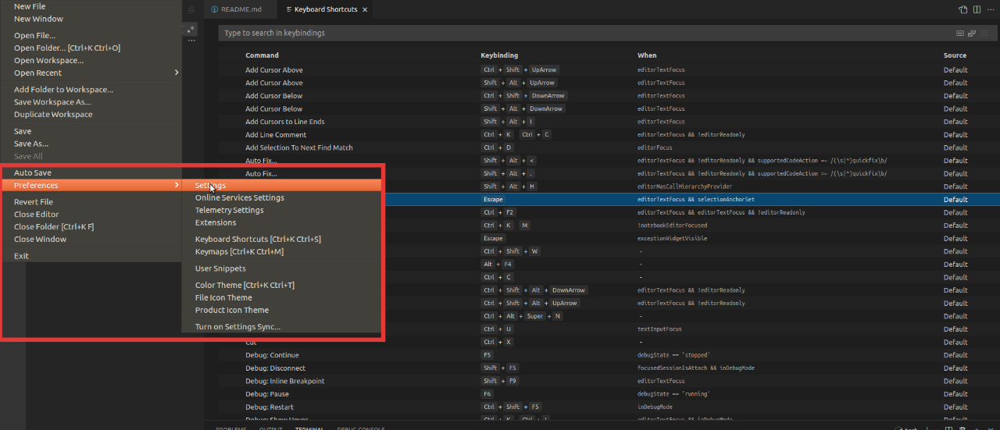
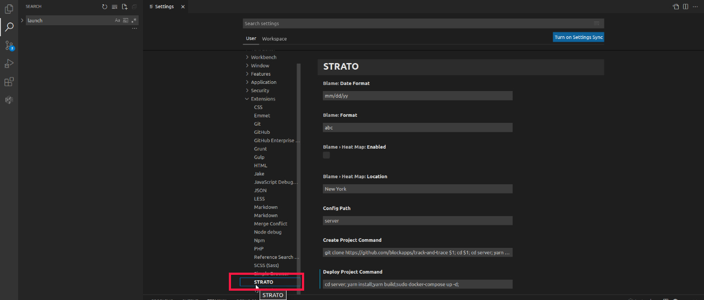

Below is a list of the default scripts for each command:  
**Create Project**
```
git clone https://github.com/blockapps/traceability-framework $1 
cd $1
cd server
yarn install
yarn build
cd ../ui
yarn install
yarn build
cd ..
```
**Deploy Project**
```
pushd server
yarn install
yarn build
touch .env
yarn deploy
popd
```
**Run Project**
```
pushd server
yarn install
yarn build
touch .env
MOCK_INT_SERVER=true yarn start:prod
popd
```

**Test Project**
```
pushd server
yarn install
yarn build
touch .env
yarn test
popd
```
## Project Management
The following lists the project commands available to use in the extension.
### Create Project 
When a user clicks **Create Project**, a text box will appear at the top of the window asking the user to input the URL of the STRATO Test Node.

After that is entered, the user will be asked to input the URL of the STRATO Production Node. Following that, the user will be asked where they would like the cloned repository to be placed in their file system.

Once that is selected, the commands specified in the Settings of the extension will be run. These commands can be changed by the user following the steps in **Customize Commands in Extension Settings**.

### Deploy Project
When a user clicks **Deploy Project**, the Dapp will be deployed to the local STRATO node. The commands run during this process are the ones specified in the Settings of the extension. The commands can be changed by the user following the steps in **Customize Commands in Extension Settings**.

Once the deployment is complete, the **Deployments** section in the extension's sidebar should display a dropdown that shows information of the deployment.

### Run Project
When a user clicks on **Run Project**, the steps to start the server for the Dapp will be exectuted following the commands specified in the **Extension Settings**. The commands can be changed by the user following the steps in **Customize Commands in Extension Settings**.

### Test Project
When a user clicks **Test Project**, the test suite of the Dapp will be run using the commands specified in the Settings of the extension. The commands to run the test are specified in the Settings of the extension and can be changed following the steps in **Customize Commands in Extension Settings**.

## Nodes
Under the list of commands in **Project Management** is **Nodes**. This will list STRATO nodes and information about those nodes. In order for the nodes to be listed, the extension looks for a `config.yaml` file found in the `server` directory of the project.  

The path of the `config.yaml` file that the extension searches for can be modified by clicking  **File -> Preferences -> Settings** and then navigating to **Extensions -> STRATO**. Once there, the path can be changed under **Config Path**.    

The `config.yaml` should contain the information about the node(s) to be displayed.
Example:
```
apiDebug: false
restVersion: 6
timeout: 120000
dappPath: ./dapp
libPath: blockapps-sol/dist
apiUrl: /api/v1
deployFilename: ./config/localhost.deploy.yaml
dappContractName: [NAME_OF_DAPP]

nodes:
  - id: 0
    url: "http://localhost:8080"
    publicKey: "6d8a80d14311c39f35f516fa664deaaaa13e85b2f7493f37f6144d86991ec012937307647bd3b9a82abe2974e1407241d54947bbb39763a4cac9f77166ad92a0"
    port: 30303
    oauth:
      appTokenCookieName: "tt_session"
      scope: "email openid"
      appTokenCookieMaxAge: 7776000000 # 90 days: 90 * 24 * 60 * 60 * 1000
      clientId: "[CLIENT_ID_GOES_HERE]"
      clientSecret: "[CLIENT_SECRET_GOES_HERE]"
      openIdDiscoveryUrl: "[OPEN_ID_DISCOVERY_URL_GOES_HERE]"
      redirectUri: "http://localhost/api/v1/authentication/callback"
      logoutRedirectUri: "http://localhost"
```

## Deployment
This will list the Deployments of the Dapp and give information about the Dapp such as the `address`, `chainID`, `block_hash`, etc.
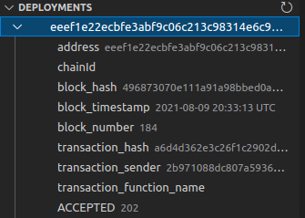

## Debugger Setup
**NOTE: The following are required in order to use the debugger:**
- The STRATO node must be started with vmDebug=true
- The version of STRATO must be 7.0 or higher  

To set the Debugger up, click on the icon for **Run and Debug**. Click the dropdown for the box with the green play arrow. 


In the dropdown, select **Add Configuration...**, which will open the `launch.json` file with a dropdown.   
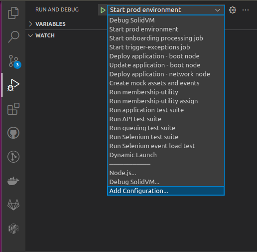

Click **Debug SolidVM** in the dropdown.   
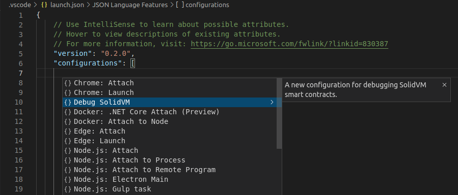
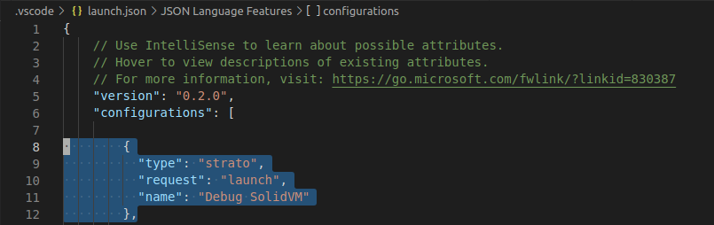

Go to the box with the green arrow once again and make sure **Debug SolidVM** is selected from the dropdown. Click the green play button itself, which should start the debugger.  
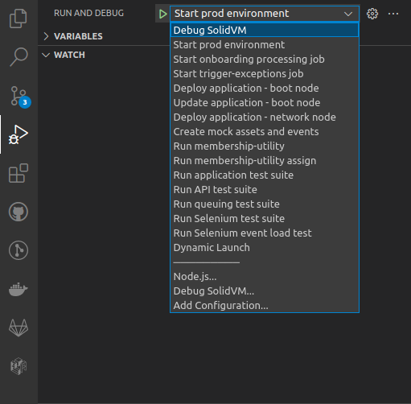
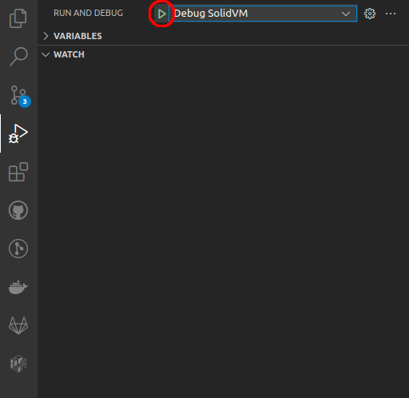

## Extension Settings
Below is an explanation of each setting for the STRATO VSCode extension. To change the settings for the STRATO VSCode extension, navigate to File > Preferences > Settings, and select Extensions > STRATO.
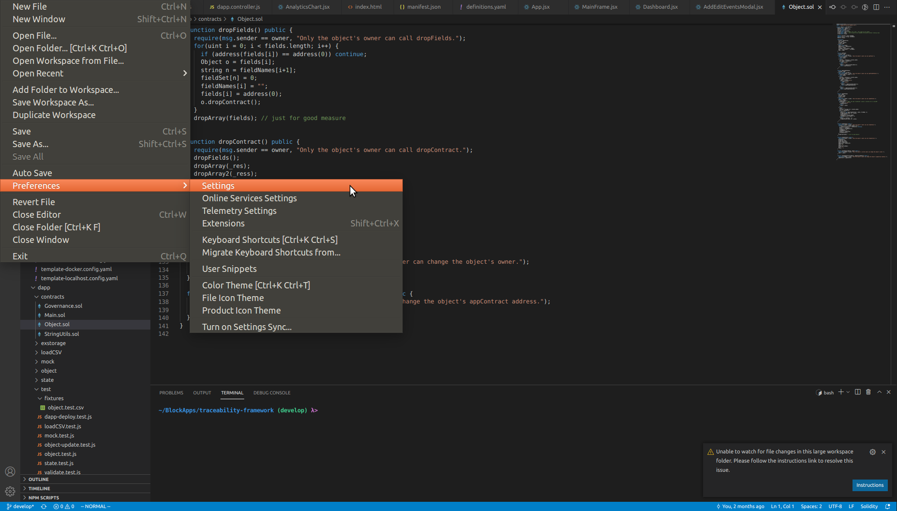
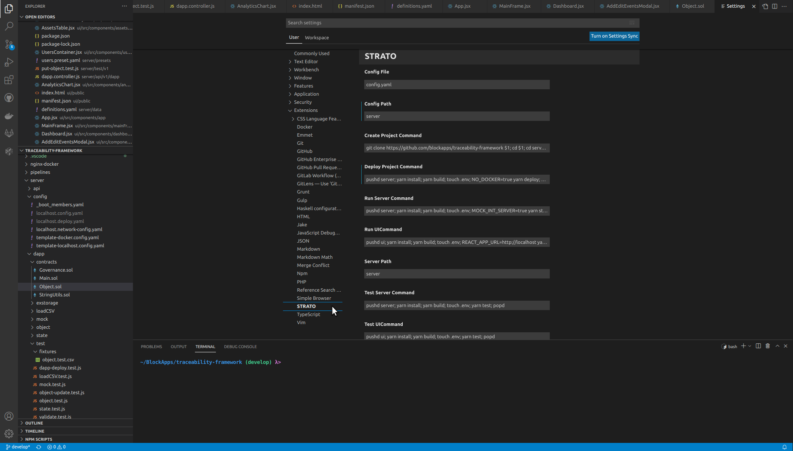

### Auto Fuzz
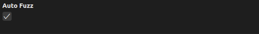

The `Auto Fuzz` setting tells the extension whether to automatically run the SolidVM code fuzzing tool after the user stops typing. Since the tool can take a long time to complete, disabling this option may be desirable in projects with many unit and/or property tests.

### Config File
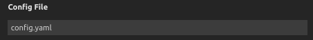

The `Config File` setting is the filename of the YAML file used to store the current project's configuration. The YAML file includes information such as a list of node URLs, OAuth credentials, and project preferences. Most of the STRATO extension's functionality depends on this value being set correctly. Typically, the project's YAML configuration is stored at "server/config.yaml", so the `Config File` setting should be "config.yaml".

### Config Path
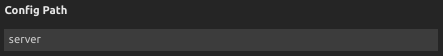

The `Config Path` setting is the directory path of the YAML file used to store the current project's configuration. The YAML file includes information such as a list of node URLs, OAuth credentials, and project preferences. Most of the STRATO extension's functionality depends on this value being set correctly. Typically, the project's YAML configuration is stored at "server/config.yaml", so the `Config Path` setting should be "server". The extension automatically adds the "/" between "server" and "config.yaml" when creating the full filepath of the config file.

### Create Project Command
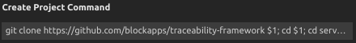

The `Create Project Command` setting is a shell script that is responsible for cloning and installing a new project in a given directory. The script takes a single parameter, a directory path, which can be accessed using "$1" in the script. The directory path is entered by the user when creating a new project, along with a test node URL and production node URL. By default, the script clones the traceability-framework repo from BlockApps' GitHub, and installs both the server and ui projects from yarn.

### Deploy Project Command
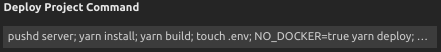

The `Deploy Project Command` setting is a shell script that is responsible for deploying a new instance of a project to a running STRATO network. The script takes no parameters.

### Run Server Command
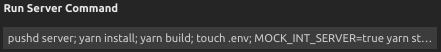

The `Run Server Command` setting is a shell script that is responsible for running an instance of the project's server, connected to a running STRATO network. The script takes no parameters.

### Run UI Command
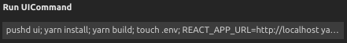

The `Run Server Command` setting is a shell script that is responsible for running an instance of the project's UI, connected to a running STRATO network. The script takes no parameters.

### Server Path
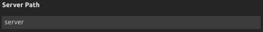

The `Server Path` setting is the path to the directory containing the project's server code. This setting is used by the test tools to combine Solidity files together to send to STRATO.

### Test Server Command
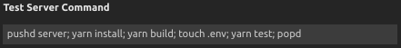

The `Test Server Command` setting is a shell script that is responsible for running project's server test suite. The script takes no parameters.

### Test UI Command
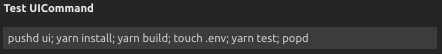

The `Test UI Command` setting is a shell script that is responsible for running project's UI test suite. The script takes no parameters.

## Troubleshooting
**I pressed step in/over/out while debugging, and the debugger appears to have resumed execution unexpectedly.**

Try pressing the pause button in the debugger control panel again.


**I have configured my extension correctly, but I am still not able to connect to my node.**

Check to make sure that the OAuth configuration in your config.yaml file matches the OAuth configuration used when starting the node.
