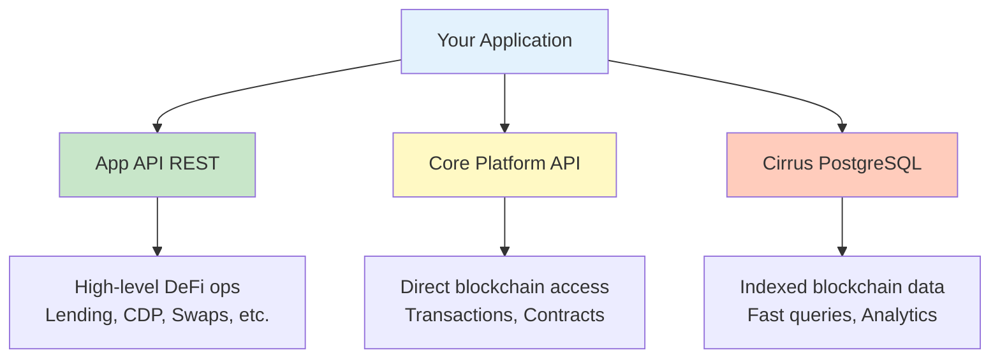

# Platform Overview

Welcome! This guide helps you understand STRATO and how to integrate your application with it.

## What is STRATO?

**STRATO** is an EVM-compatible blockchain platform optimized for DeFi with:

- **Fast finality** (~1-2 second block times)
- **Low fees** (< $0.10 per transaction)
- **EVM compatibility** (Solidity smart contracts)
- **Rich API layer** (REST + JSON-RPC)
- **Indexed data** (Cirrus for fast queries)

**Why build on STRATO:**

- **Lower costs** - Cheaper than Ethereum mainnet
- **Faster UX** - ~1-2 second finality
- **Full-stack APIs** - No need for own indexer
- **Active DeFi** - Lending, swaps, CDP ecosystem

## Integration Overview

### Architecture Layers



### When to Use What

| Layer | Use Cases | Best For |
|-------|-----------|----------|
| **App API** | User operations, wallets, DeFi actions | Easy integration, business logic |
| **Core Platform API** | Custom contracts, raw transactions | Full control, advanced use cases |
| **Cirrus** | Analytics, reporting, historical queries | Fast queries, SQL-like access |

## Prerequisites

### Technical Requirements

**You should have:**

- **JavaScript/TypeScript** - For API integration
- **Web3 fundamentals** - Transactions, gas, signing
- **Node.js 18+** - Or Python 3.9+, Go 1.19+, etc.
- **REST APIs** - Basic understanding

**Optional but helpful:**

- **Solidity** - For smart contract development
- **Docker** - For local testing
- **ethers.js or web3.js** - Prior experience

### STRATO Account

**Testnet** (recommended for development):

- Contact STRATO team for testnet credentials
- Or use testnet faucet for free tokens
- Test safely without risk

**Mainnet** (for production):

- Create account via STRATO UI
- Fund with bridged assets
- Request API key for higher rate limits

### API Access

**Base URLs:**

- **Production API** - `https://app.strato.nexus/api`
- **Production Node** - `https://app.strato.nexus/strato-api`
- **Testnet API** - `https://buildtest.mercata-testnet.blockapps.net/api`
- **Testnet Node** - `https://buildtest.mercata-testnet.blockapps.net/strato-api`

**Authentication:**

- **OAuth 2.0** - For user operations
- **API keys** - For admin/service operations
- **Public** - No auth for read-only endpoints

**Rate Limits:**

- **Authenticated** - 1,000 requests/minute
- **Public** - 100 requests/minute
- **WebSocket** - 50 subscriptions per connection

## Quick Start

### 1. Set Up Environment

```bash
# Create project
mkdir strato-integration && cd strato-integration
npm init -y

# Install dependencies
npm install axios ethers

# Create config
cat > config.js << EOF
export const CONFIG = {
  // Production
  API_BASE_URL: 'https://app.strato.nexus/api',
  
  // Or use Testnet for development
  // API_BASE_URL: 'https://buildtest.mercata-testnet.blockapps.net/api'
};
EOF
```

### 2. Test Authentication

```javascript
const axios = require('axios');

// Get OAuth token from Keycloak (for service accounts)
async function getAccessToken() {
  const response = await axios.post(
    'https://keycloak.blockapps.net/auth/realms/mercata/protocol/openid-connect/token',
    new URLSearchParams({
      grant_type: 'client_credentials',
      client_id: process.env.OAUTH_CLIENT_ID,
      client_secret: process.env.OAUTH_CLIENT_SECRET
    }),
    {
      headers: { 'Content-Type': 'application/x-www-form-urlencoded' }
    }
  );
  return response.data.access_token;
}

// Test
const token = await login('testuser', 'testpass');
console.log('Logged in:', token);
```

### 3. Make Your First API Call

```javascript
// Get user's tokens
const tokens = await axios.get(`${BASE_URL}/tokens/v2`, {
  headers: { 'Authorization': `Bearer ${token}` },
  params: { status: 'neq.2', limit: 10 }
});

console.log('User tokens:', tokens.data);
```

## Core Integration Guide

### Complete End-to-End Integration

For a comprehensive walkthrough with code examples for all operations:

→ **[API Integration Guide](e2e.md)**

**Covers:**

- Authentication and session management
- Token queries and balances
- Bridge operations
- Swap execution
- Lending pool integration
- CDP vault management
- Rewards tracking

## Key Concepts

### Authentication Flow

OAuth 2.0 with access/refresh tokens:

```javascript
// 1. Login → get access token + refresh token
// 2. Use access token for API calls
// 3. Refresh when expired (auto-retry on 401)
```

### Transaction Lifecycle

```
1. Prepare transaction
2. Approve token spending (if ERC20)
3. Submit main transaction
4. Wait for confirmation (~5-10 sec)
5. Verify success
```

### Big Number Handling

```javascript
// ❌ WRONG
const amount = 1.5 * 1e18;  // Precision loss!

// ✅ CORRECT
const amount = BigInt(15) * BigInt(10 ** 17);
```

### Error Handling

```javascript
// Handle 401 (auth expired) → refresh token → retry
// Handle 429 (rate limit) → backoff → retry
// Handle 500 (server error) → exponential backoff
```

## Development Workflow

### 1. Test on Testnet

- Use free test tokens
- No real value at risk
- Same API as production
- Iterate quickly

### 2. Write Tests

```javascript
// Unit tests for calculations
// Integration tests for API flows
// End-to-end tests for complete workflows
```

### 3. Monitor and Debug

```javascript
// Log API responses
// Track rate limit headers
// Monitor transaction status
// Set up error alerts
```

### 4. Deploy to Production

```javascript
// Switch to mainnet URLs
// Use production API keys
// Enable monitoring and logging
// Have rollback plan ready
```

## Security Best Practices

### API Key Management

```javascript
// ❌ WRONG - Hardcoded
const API_KEY = "sk_live_abc123";

// ✅ CORRECT - Environment variables
const API_KEY = process.env.STRATO_API_KEY;
```

### Input Validation

```javascript
// Validate addresses (40 hex characters)
// Validate amounts (positive, reasonable)
// Sanitize user input
// Check transaction parameters
```

### Transaction Verification

```javascript
// Verify transaction confirmed
// Check from/to addresses match expected
// Validate amounts transferred
// Handle failures gracefully
```

## Common Integration Patterns

### Pattern 1: Wallet Dashboard

Fetch all user data in parallel for fast loading.

### Pattern 2: Liquidation Bot

Monitor positions via WebSocket, execute liquidations when profitable.

### Pattern 3: Analytics Dashboard

Query Cirrus directly for historical data and trends.

## Resources

### Documentation
- **[API Reference](../reference/api.md)** - Complete API documentation
- **[Core Platform API](../reference/strato-node-api.md)** - Direct blockchain access
- **[Architecture](../reference/architecture.md)** - System design and components

### Code Examples
- **GitHub**: [Provide repo link with examples]
- **SDK**: [NPM package if available]
- **Boilerplates**: [Starter templates]

### Support

We're here to help! Reach out through any of these channels:

- **Documentation**: [docs.strato.nexus](https://docs.strato.nexus)
- **Support**: [support.blockapps.net](https://support.blockapps.net)
- **Telegram**: [t.me/strato_net](https://t.me/strato_net)

## Next Steps

### Ready to Build?

→ **[Integration Guide](integration.md)**

Complete walkthrough with code examples for auth, tokens, bridge, swaps, lending, CDP, and rewards.

### Need Reference Docs?

- **[Interactive API (Swagger UI)](../reference/interactive-api.md)** - Explore and test the API interactively
- **[API Overview](../reference/api.md)** - High-level API documentation
- **[API Cheat Sheet](quick-reference.md)** - Code snippets for common operations

