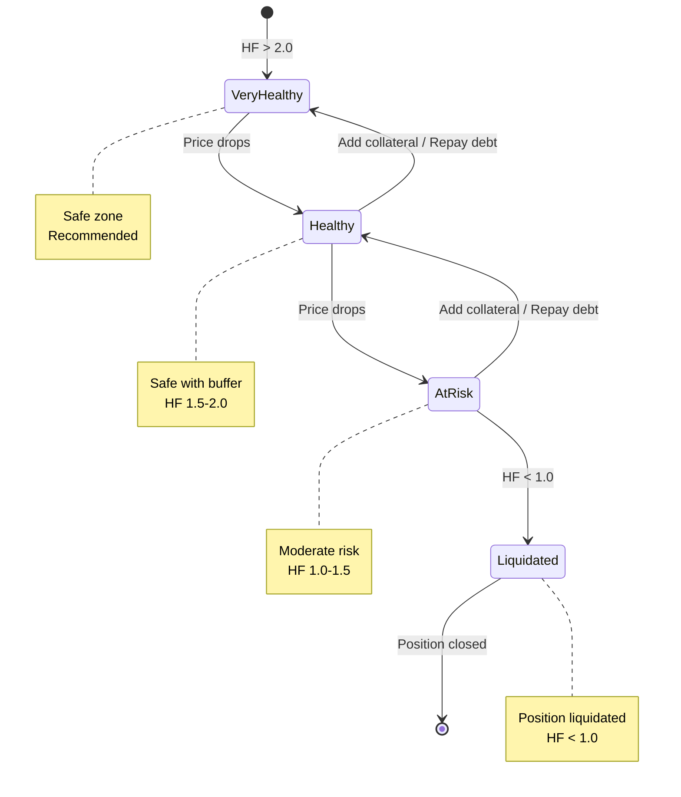

# Core Concepts for End Users

Essential concepts you must understand before using STRATO DeFi.

## Transaction Vouchers

**Definition:** Free transaction fee credits automatically given when you bridge assets to STRATO.

**Key points:**

- **10 vouchers** per bridge-in (every time you bridge)
- Each voucher covers **1 transaction fee**
- Used automatically before USDST
- After vouchers run out, fees are 0.01 USDST (~$0.01) per transaction

**How it works:**
```
1. Bridge assets to STRATO
2. Receive 10 free vouchers automatically
3. First 10 transactions: FREE (voucher used)
4. After 10 transactions: 0.01 USDST per transaction
```

**Example:**
```
Bridge 0.5 ETH to STRATO
→ Receive 10 vouchers
→ Do 10 transactions for free
→ Bridge more assets later
→ Receive 10 more vouchers
```

**Getting more vouchers:**
- Bridge assets again (any amount, any time)
- Each bridge-in gives you 10 more vouchers

---

## Wrapped Tokens

**Definition:** STRATO versions of Ethereum assets that you can use for DeFi operations on STRATO.

**Why wrapped tokens?**

When you bridge assets from Ethereum to STRATO, they become "wrapped" to work on the STRATO blockchain:

- **On Ethereum**: You have ETH, USDC, WBTC
- **On STRATO**: You have ETHST, USDCST, WBTCST (wrapped versions)
- **1:1 Peg**: Always exchangeable 1:1 with the original

**How it works:**

```
Bridge ETH from Ethereum → Receive ETHST on STRATO
Use ETHST on STRATO → Bridge back → Receive ETH on Ethereum
```

**Common wrapped tokens:**

| Original (Ethereum) | Wrapped (STRATO) | Type |
|---------------------|------------------|------|
| ETH | ETHST | Wrapped ETH |
| WBTC | WBTCST | Wrapped BTC |
| USDC | USDCST | Wrapped USDC |
| USDT | USDTST | Wrapped USDT |
| Gold tokens | GOLDST | Gold |
| Silver tokens | SILVST | Silver |

**Key points:**

- ✅ **All STRATO operations** use wrapped tokens (swaps, lending, collateral, pools)
- ✅ **Bridge operations** convert automatically (ETH → ETHST when bridging in)
- ✅ **Always 1:1** - No slippage or conversion fees between original and wrapped
- ✅ **Secure** - Backed by locked original assets on Ethereum

**Example:**

```
1. You bridge 2 ETH from Ethereum to STRATO
2. You receive 2 ETHST on STRATO
3. You use ETHST to:
   - Supply as collateral
   - Swap for USDCST
   - Provide liquidity in ETHST-USDCST pool
4. Later, bridge 2 ETHST back to Ethereum
5. You receive 2 ETH on Ethereum
```

**Why this matters:**

Throughout the documentation, you'll see:
- "Supply ETHST" (not "Supply ETH")
- "USDST-USDCST pool" (not "USDST-USDC pool")
- "Swap USDCST → ETHST" (not "Swap USDC → ETH")

This is because on STRATO, you're working with the wrapped versions!

---

## Collateral

**Definition:** Assets you deposit to back your borrowing or minting.

**Key points:**

- Locked while you have debt outstanding
- Value determines how much you can borrow/mint
- Can be liquidated if value drops too much
- Each asset has different parameters (LTV, liquidation threshold)

**Example:**
```
Deposit: 1 ETHST ($3,000)
Can borrow: Up to ~$2,100 (70% LTV)
If ETHST drops to $2,000: Position at risk
```

## Health Factor (Lending)

**Definition:** Ratio showing how safe your lending position is.

**Formula:**
```
Health Factor = (Collateral Value × Liquidation Threshold) / Borrowed Amount
```

**Rules:**

- **> 2.0**: Very safe (recommended)
- **1.5 - 2.0**: Safe with buffer
- **1.0 - 1.5**: Moderate risk
- **< 1.0**: LIQUIDATION occurs

**Visual Guide:**



**Example:**
```
Collateral: 10 ETHST @ $3,000 = $30,000
Liquidation threshold: 80%
Borrowed: 15,000 USDST

Health Factor = ($30,000 × 0.8) / $15,000 = 1.6
Status: Safe, but watch ETHST price
```

## Collateralization Ratio (CDP)

**Definition:** Ratio of collateral value to minted USDST (CDP version of health factor).

**Formula:**
```
CR = (Collateral Value / Minted USDST) × 100%
```

**Rules:**

- **200%+**: Very safe
- **150-200%**: Moderate risk
- **< 150%**: Often liquidated (varies by asset)

**Example:**
```
Collateral: 5 ETHST @ $3,000 = $15,000
Minted: 10,000 USDST

CR = ($15,000 / $10,000) × 100% = 150%
Status: At minimum - risky!
```

## USDST

**Definition:** STRATO's USD-pegged stablecoin.

**Key points:**

- Pegged to $1 USD
- Can be obtained by borrowing (Lending) or minting (CDP)
- Used for fees, trading, and as stable value storage
- Must be repaid/burned to unlock collateral

**Uses:**

- Pay transaction fees on STRATO
- Stable asset for trading
- Collateral for other DeFi operations
- Bridge out for USD on other chains

## Reward Points

**Definition:** STRATO's governance and rewards token.

**Key points:**

- Earned by participating in DeFi activities
- Used for governance voting (future)
- Can be traded or held for value
- Rewards distributed seasonally

**How to earn:**

- Supply collateral to lending pool
- Borrow USDST
- Provide liquidity to swap pools
- Mint USDST via CDP
- Complete swaps

## Liquidation

**Definition:** Forced closure of your position when collateral value falls too low.

**What happens:**

1. Your position health factor < 1.0 (or CR < minimum)
2. A liquidator repays your debt
3. Liquidator takes your collateral + bonus (5-10%)
4. You lose collateral value beyond your debt

**Example liquidation:**
```
Before:

- Collateral: 1 ETHST @ $3,000
- Borrowed: 2,400 USDST
- Health factor: 1.0

ETHST drops to $2,800:

- Health factor: 0.93
- LIQUIDATION TRIGGERED

After:

- Lost: 1 ETHST ($2,800)
- Kept: 2,400 USDST
- Net loss: $400 + liquidation penalty (~$140)
- Total loss: ~$540
```

**How to avoid:**

- Maintain high health factor (2.0+) or CR (200%+)
- Add collateral when prices drop
- Repay debt to improve ratio
- Set price alerts

## Impermanent Loss (Liquidity Provision)

**Definition:** Loss from providing liquidity to swap pools when token prices diverge.

**When it happens:**

- You provide liquidity to a pool (e.g., ETH-USDC)
- Token prices change significantly
- Pool auto-rebalances
- You end up with different amounts than if you just held

**Example:**
```
Initial deposit:

- 1 ETHST ($3,000) + 3,000 USDCST = $6,000 total

ETH doubles to $6,000:

- Pool rebalances to: 0.707 ETH + 4,242 USDC
- Pool value: $8,485
- If you just held: 1 ETHST ($6,000) + 3,000 USDCST = $9,000
- Impermanent loss: $515 (5.7%)

BUT: Swap fees earned may offset this loss
```

**When it's worth it:**

- High trading volume pools (lots of fees)
- Stablecoin-stablecoin pairs (minimal price divergence)
- Short-term price movements (loss is "impermanent")

## Slippage

**Definition:** Difference between expected and actual trade price.

**Causes:**

- Pool size too small for your trade
- Price moves between preview and execution
- Network congestion delays

**Example:**
```
Expected: Swap 1 ETH for 3,000 USDC
Slippage: 0.5%
Minimum received: 2,985 USDC

If price moves more than 0.5%, transaction reverts
```

**Settings:**

- Low slippage (0.1-0.5%): Safer, may fail in volatile markets
- High slippage (1-5%): More tolerant, risk of worse price

## Quick Reference

### Key Metrics to Remember

- **Health Factor > 2.0** (lending) or **CR > 200%** (CDP) = Safe
- **Always keep reserve USDST** for transaction fees
- **Monitor prices daily** when you have active positions
- **Set alerts** at liquidation prices

### Transaction Flow

Typically:

1. Approve token spending (one-time per token)
2. Execute main action (supply, borrow, swap, etc.)
3. Wait for confirmation (~5-10 seconds)
4. Check transaction success

---

## Available Tokens

STRATO supports various tokens for trading, lending, and collateral.

!!! info "Understanding Wrapped Tokens"
    All tokens bridged from Ethereum are automatically wrapped to work on STRATO. See [Wrapped Tokens](#wrapped-tokens) section above for details.

### Native & Wrapped Assets

**ETHST** (Wrapped ETH):

- Bridged from Ethereum mainnet
- 1:1 peg with ETH
- Primary trading and collateral asset

**WBTCST** (Wrapped BTC):

- Bridged from Ethereum (WBTC)
- Represents Bitcoin value
- High-value collateral

### Stablecoins

**USDST** (STRATO USD):

- Protocol stablecoin (described above)
- Minted via CDP or borrowed from lending pool
- Pegged to 1 USD
- Used for fees and trading

**USDCST** (Wrapped USDC):

- Bridged from Ethereum
- 1:1 with USDC
- Stable collateral and trading pair

**USDTST** (Wrapped USDT):

- Bridged from Ethereum
- 1:1 with USDT
- Stable collateral option

### Commodity Tokens

**GOLDST** (Gold):

- Represents gold value
- Commodity-backed
- Trading and collateral

**SILVST** (Silver):

- Represents silver value
- Commodity-backed
- Trading pair with GOLDST

### Governance

**Reward Points**:

- STRATO governance token (described above)
- Earned through DeFi activities
- Used for voting and governance

!!! tip "Getting Tokens"
    Most tokens are obtained by **[bridging from Ethereum](guides/bridge.md)**. USDST and Reward Points are earned/minted on STRATO directly.

## Next Steps

Now that you understand the core concepts:

- **[Quick Start Guide](quick-start.md)** - Get set up in 10 minutes
- **[Review Safety Practices](safety.md)** - Security and risk management
- **[Borrow USDST Guide](guides/borrow.md)** - Put concepts into practice
- **[Mint USDST via CDP Guide](guides/mint-cdp.md)** - Alternative approach


