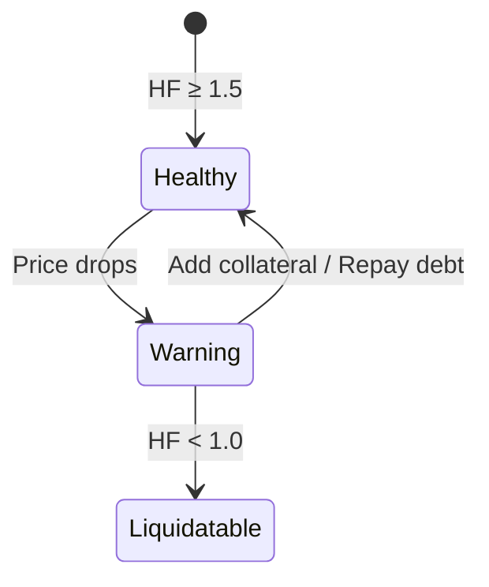

# Core Concepts

Essential concepts to understand before using or building on STRATO. The first part covers the platform. The second covers the DeFi features.

---

## Platform Basics

### Networks

| Network | Name | App | Chain ID (`eth_chainId`) |
|---|---|---|---|
| Mainnet | upquark | [app.strato.nexus](https://app.strato.nexus) | 123354377739506 (`0x7030addddcf2`) |
| Testnet | helium | [app.testnet.strato.nexus](https://app.testnet.strato.nexus) | 195049586845898 (`0xb165855668ca`) |

Tokens and balances on testnet have no value. See [Networks](platform/networks.md).

### Accounts and Wallets

You can use STRATO with either kind of account:

- **STRATO account (custodial).** You sign in with OpenID Connect (the **STRATO Wallet** option in the app). Your private key is generated and held by the STRATO **Vault** on your first authenticated request, and transactions are signed server-side for you. No seed phrase.
- **Self-custody wallet.** You connect MetaMask, Coinbase Wallet, or a WalletConnect wallet. The app builds each transaction, and you sign it in your wallet.

On-chain, usernames are registered in the `UserRegistry` system contract. See [Identity & Vault](platform/identity-and-vault.md).

### Transaction Fees

Every transaction pays a flat fee through the **Decider** system contract (`0xDEC1DE`), before the transaction runs:

- **1 voucher**, if you hold one, otherwise
- **0.01 USDST**

There is no gas price or fee market. If neither a voucher nor 0.01 USDST is available, the transaction is rejected. A transaction that reverts still pays its fee. App actions that send several transactions (for example approve plus supply) pay the fee once per transaction.

With Staking V2, part of each USDST fee is credited to the block proposer's validator and its delegators. The rest goes to the protocol fee collector. See [Transactions & Fees](platform/transactions-and-fees.md).

### Transaction Vouchers

**Definition:** Prepaid fee credits.

- One voucher pays one transaction fee in place of 0.01 USDST
- Used automatically before USDST
- The bridge service credits **25 vouchers** for each confirmed bridge deposit
- Vouchers cannot be transferred

### USDST

**Definition:** STRATO's USD-pegged stablecoin, and the token used to pay transaction fees.

- Minted against collateral in a **CDP vault**, from the app's **Borrow** page (a separate `LendingPool` contract exists, but the app does not currently offer lending-pool borrowing)
- Overcollateralized: CDP positions below their liquidation ratio can be liquidated
- Used for fees, trading, pools, savings, and as a stable unit of account

### Consensus and Finality

STRATO uses **PBFT-style consensus** (blockstanbul). A block is final once the validators commit it. Validators are tracked by the `MercataGovernance` system contract.

With **Staking V2** (active on testnet; on mainnet it activates at block 1,000,000):

- Operators register, stake $STRATO (self-bond plus delegations), and activate to join the validator set
- The block proposer is chosen in proportion to stake
- The proposer can earn a flat block reward, when the fee contract is funded

See [Consensus & Staking](platform/consensus.md).

### SolidVM

STRATO executes smart contracts with **SolidVM**, which runs a Solidity dialect. There is **no EVM bytecode execution**.

The node still accepts Ethereum-format signed transactions (for example via `eth_sendRawTransaction`) and serves Ethereum-style JSON-RPC, so standard wallets can sign for STRATO. See [SolidVM](solidvm/index.md).

### Cirrus (Indexed Data)

**Cirrus** indexes contract state and events into Postgres and serves them read-only over a REST interface at `/cirrus/search`. Apps use it to query balances, positions, and history without scanning blocks. See [Cirrus](reference/cirrus.md).

---

## DeFi Concepts

### Bridged Tokens

**Definition:** STRATO-side tokens that represent assets deposited from another chain.

When you bridge a supported asset in, the bridge contract credits the matching STRATO token to your address. When you bridge out, the STRATO token is taken and the original asset is released on the destination chain.

- STRATO tokens are named after their source asset, for example "STRATO ETH" (symbol `ETH`) or "STRATO USDC" (symbol `USDC`)
- One STRATO token can be fed from several chains (for example, ETH from Ethereum and from Base)
- Supported chains and assets are configured on-chain, and the app's **Fund** page shows the current list
- Bridge-outs are not instant and depend on available bridge liquidity

**GOLDST** and **SILVST** are tokenized gold and silver. You can buy them in the app (Fund → Metals), and some bridged gold tokens (such as XAUt) can be routed into GOLDST.

### Collateral

**Definition:** Assets you deposit to back your borrowing or minting.

- Locked while you have debt outstanding
- Its value determines how much you can borrow or mint
- Can be liquidated if its value falls too far
- Each asset has its own on-chain CDP parameters: liquidation ratio, minimum CR, liquidation penalty, stability fee, debt floor and debt ceiling

CDP vaults are **per asset**. Collateral in your ETH vault does not back debt in your WBTC vault, and each vault is liquidated on its own. The lending pool keeps its collateral in a separate `CollateralVault`.

### Collateralization Ratio (CR)

**Definition:** A vault's collateral value divided by the USDST minted against it.

```
CR = (Collateral Value / Minted USDST) × 100%
```

Each collateral asset has two thresholds:

- **Liquidation ratio**: below this CR, the vault can be liquidated
- **Minimum CR**: at or above the liquidation ratio. Minting and withdrawing collateral must keep your CR at or above it

Stability fees accrue continuously on minted USDST, at a rate set per asset.

### Health Factor

**Definition:** How close a vault is to liquidation, as shown on the app's **Borrow** page.

```
Health Factor = CR / Liquidation Ratio
```

- **≥ 1.5**: shown normally in the vault list
- **1.0 - 1.5**: highlighted as a warning
- **< 1.0**: can be liquidated

The mint planner's slider labels a target health factor from **Low Risk** (2.5 or higher) to **High Risk** (below 1.5).


```mermaid
stateDiagram-v2
    [*] --> Healthy: HF ≥ 1.5
    Healthy --> Warning: Price drops
    Warning --> Liquidatable: HF < 1.0

    Warning --> Healthy: Add collateral / Repay debt
```

**Example** (illustrative prices and parameters):
```
Collateral: 1 ETH @ $3,000
Minted: 1,500 USDST
Liquidation ratio: 150%

CR = $3,000 / 1,500 = 200%
Health Factor = 200% / 150% ≈ 1.33
```

### Liquidation

**Definition:** Forced repayment of your debt from your collateral when a vault becomes unsafe.

When a vault's CR falls below its asset's liquidation ratio (health factor below 1), any user can repay part of the vault's debt, up to the asset's close factor. In return they receive collateral worth the repaid USDST plus the asset's **liquidation penalty**, valued at the oracle price. You keep the USDST you minted.

**Example** (illustrative: 150% liquidation ratio, 50% close factor, 10% penalty):
```
Collateral: 1 ETH, Minted: 1,500 USDST
ETH drops to $2,200 → CR ≈ 146.7%, HF ≈ 0.98 → liquidatable

Liquidator repays 750 USDST
Collateral seized: 750 × 1.10 / 2,200 = 0.375 ETH
Left in your vault: 0.625 ETH and 750 USDST of debt
```

!!! note "Lending pool"
    The `LendingPool` contract uses its own health factor, `(collateral value × liquidation threshold) / debt`, and a liquidation bonus instead of a penalty. The app does not currently show lending-pool borrowing.

**How to avoid it:**

- Keep a buffer above HF 1.0 or the liquidation ratio
- Add collateral or repay debt when prices fall
- Watch the app's liquidation alerts

### Impermanent Loss (Liquidity Provision)

**Definition:** The shortfall versus simply holding, caused by price divergence while your tokens are in a pool.

**Example** (standard constant-product pool, illustrative):
```
Deposit: 1 ETH ($3,000) + 3,000 USDST = $6,000

ETH doubles to $6,000:
- Pool position: ≈0.707 ETH + ≈4,243 USDST ≈ $8,485
- If held: $9,000
- Impermanent loss ≈ $515 (5.7%)
```

Swap fees earned can offset this. Stable pairs see little divergence.

### Swap Fees

Standard pools charge a swap fee on the input amount. The default is **0.3%**, of which **70%** stays in the pool for liquidity providers and the rest goes to the protocol fee collector. Individual pools can use different parameters, and stable pools and concentrated-liquidity (V3) pools have their own fee settings.

### Slippage

**Definition:** The difference between the quoted and executed trade price.

- Larger trades relative to pool size move the price more
- The price can move between quote and execution
- Your slippage tolerance sets the minimum output. If execution would fall below it, the transaction reverts (and still pays its fee)

### Reward Points

**Definition:** Rewards earned for eligible on-chain activity, paid in the `CATA` token.

- Activities (for example providing liquidity, lending, or one-time actions such as swaps) and their emission rates are configured in the Rewards contract
- Rewards accrue continuously and can be claimed at any time
- See the [Rewards guide](guides/rewards.md)

---

## Available Tokens

The token list is on-chain and changes over time. Common tokens:

| Token | What it is |
|---|---|
| **USDST** | STRATO's USD stablecoin; pays transaction fees |
| **ETH, WBTC, wstETH, rETH, USDC, USDT, PAXG, XAUt, …** | Bridged tokens (see [Bridged Tokens](#bridged-tokens)) |
| **GOLDST / SILVST** | Tokenized gold and silver |
| **STRATO** | The network token, used for staking ([Tokenomics](tokenomics.md)) |
| **CATA** | Reward Points token |
| **Voucher** | Non-transferable fee credits |

!!! tip "Getting Tokens"
    Most tokens are obtained by **[bridging in](guides/bridge.md)**. USDST is minted or borrowed on STRATO, GOLDST/SILVST can be bought in the app, and Reward Points are earned.

## Next Steps

- **[Quick Start Guide](quick-start.md)** - Get set up
- **[Safety Practices](safety.md)** - Security and risk management
- **[Borrow USDST Guide](guides/borrow.md)** - Put concepts into practice
- **[Mint USDST via CDP Guide](guides/mint-cdp.md)** - Alternative approach
