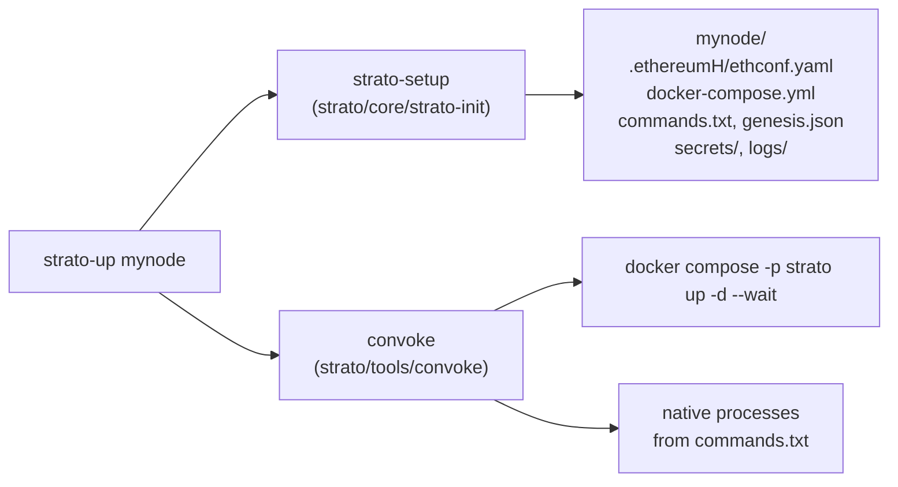

# Architecture - STRATO Platform

How the `strato-platform` monorepo is organized and how its parts fit together at runtime.

---

## Repository Layout

| Path | Contents |
|------|----------|
| `strato/` | Blockchain core in Haskell: `core/`, `api/`, `VM/`, `indexer/`, `vault/`, `highway/`, `tools/`, `libs/` |
| `app/` | App layer: `contracts/`, `backend/`, `ui/`, `services/`, `nginx/`, `packages/shared-types/`, `ethereum/`, `adapters/`, `scripts/`, `docs/` |
| `apex/` | apex, the backend for the STRATO Management Dashboard (Node.js/Express) |
| `smd-ui/` | STRATO Management Dashboard UI (Vite/React/TypeScript), served at `/smd/` |
| `nginx-packager/` | The node's edge proxy image (OpenResty with OIDC and CSRF handling) |
| `postgrest-packager/`, `prometheus-packager/` | PostgREST and Prometheus images for the node |
| `local-auth/` | Bundled Ory Kratos + Hydra identity provider, used with `--localAuth` |
| `vault-nginx/`, `highway-nginx/` | Proxies for the separately deployed Vault and Highway file server |
| `bin/` | Node lifecycle scripts: `strato-login`, `strato-up`, `strato-down`, `strato-ps`, `strato-snapshot`, `strato-patch-app`, `strato-user-add`, `strato-logrotate` |
| `pipelines/` | Jenkins pipelines |
| `scripts/` | Repository scripts, including the `pre-commit` hook |
| `strato-vscode/` | VS Code extension |
| `design-documents/`, `load-testing/` | Design notes and load tests |
| `techdocs/` + `mkdocs.yml` | This documentation site |
| `Makefile`, `install_deps.sh`, `Dockerfile.multi` | Build entry points |

---

## How a Node Runs

A node is a mix of **native host processes** (the Haskell binaries installed by `make`) and **Docker services**.

`strato-setup` generates the node directory:

- `.ethereumH/ethconf.yaml` is the node's configuration source of truth.
- `docker-compose.yml` is generated by `strato/core/strato-init/src/Blockchain/Init/DockerCompose.hs`.
- `commands.txt` lists the native processes to run.

`convoke` then starts the containers and the native processes. If any one of them exits, it tears the whole node down. The `docker-compose*.yml` files in the repository root are not used by `strato-up`.

### Native processes

| Process | Source | Role |
|---------|--------|------|
| `ethereum-discover` | `strato/core/ethereum-discovery` | Peer discovery (port 30303) |
| `strato-p2p` | `strato/core/strato-p2p` | Peer connections; exchanges blocks and transactions (port 30303) |
| `strato-sequencer` | `strato/core/strato-sequencer`, `strato/core/blockstanbul` | PBFT (blockstanbul) ordering and block commit |
| `vm-runner` | `strato/core/vm-runner`, `strato/VM/SolidVM` | Executes transactions with SolidVM |
| `strato-indexer` | `strato/indexer/strato-index` | Indexes chain data into Postgres and Redis |
| `slipstream` | `strato/indexer/slipstream` | Writes contract state and events into the Postgres `cirrus` database |
| `strato-api` | `strato/api/strato-api`, `strato/api/core`, `strato/api/bloc` | Core API (`/eth/v1.2`) and Bloc API (`/bloc/v2.2`); Bloc is a library inside `strato-api` |
| `ethereum-jsonrpc` | `strato/api/ethereum-jsonrpc` | Ethereum JSON-RPC; on by default (`--jsonrpc`) |
| `strato-network-monitor` | `strato/core/ethereum-discovery` | Network monitoring |
| `strato-logrotate` | `bin/strato-logrotate` | Rotates files in `logs/` |
| `blockapps-vault-wrapper-server` | `strato/vault` | Node-local Vault; only with `--localAuth` |

Each native process writes to `logs/<process>` in the node directory.

### Docker services

| Service | Source | Role |
|---------|--------|------|
| `nginx` | `nginx-packager/` | Edge proxy: routing, OIDC login, CSRF |
| `app-backend` | `app/backend/` | App REST API (port 3001 inside the compose network) |
| `app-ui` | `app/ui/` | App web UI (port 8080 inside the compose network) |
| `smd` | `smd-ui/` | STRATO Management Dashboard |
| `apex` | `apex/api/` | Dashboard backend; also serves `/health` |
| `postgres` | `postgres:14.18` | Databases for the indexer and Cirrus |
| `postgrest` | `postgrest-packager/` | Read-only REST over the `cirrus` database (`/cirrus/search`) |
| `redis` | `redis:3.2` | Redis BlockDB used by core processes (p2p, sequencer, vm-runner, indexer, API) |
| `prometheus` | `prometheus-packager/` | Metrics scraping |
| `docs` | `swaggerapi/swagger-ui` | Swagger UI container |
| `local-auth` | `local-auth/` | Ory Hydra + Kratos; only with `--localAuth` |

Postgres (5432) and Redis (6379) are published on `127.0.0.1` only. nginx is the only service exposed publicly.

### Streaming

Node processes pass events to each other through an embedded streaming layer.

- **19.1 and later:** embedded **JLog** (`strato/libs/jlog-c`, `strato/libs/composable-monads/streaming-jlog`). It needs no broker container.
- **Before 19.1:** the node ran Kafka.

The Kafka, Redpanda and RabbitMQ streaming backends are still in `strato/libs/composable-monads/` and in the Stack build.

### Cirrus

There is no `cirrus` binary. "Cirrus" is three parts working together:

- **slipstream** indexes contract state and events.
- **The `cirrus` Postgres database** stores them.
- **PostgREST** serves them read-only at `/cirrus/search`.

See [Cirrus](../reference/cirrus.md).

### Virtual machine

STRATO executes contracts with **SolidVM** only (`strato/VM/SolidVM`).

- The EVM execution engine was removed in 15.0.
- `strato/VM/evm-solidity` is an ABI library.
- `strato/VM/EVM/ethereum-vm` is still in the tree, but it is commented out of `strato/stack.yaml` and is not built.

See [SolidVM](../solidvm/index.md).

### Other core packages

| Path | Purpose |
|------|---------|
| `strato/core/strato-init` | `strato-setup`: node directory, `ethconf.yaml`, compose file and `commands.txt` generation |
| `strato/core/strato-genesis` | Genesis block templates and pre-deployed system contracts (`resources/`) |
| `strato/core/strato-networks` | Network definitions (upquark, helium, ...) |
| `strato/core/strato-conf` | `ethconf.yaml` schema |
| `strato/core/blockstanbul` | PBFT consensus |
| `strato/vault` | Vault server that holds custodial user keys |
| `strato/highway` | Highway file server (deployed separately) |
| `strato/tools/airlock` | Wallet CLI |

The Haskell build uses Stack (resolver in `strato/stack.yaml`). All local packages compile with `-Wall -Werror`.

---

## App Layer (`app/`)

### Smart contracts (`app/contracts/`)

| Directory | Contents |
|-----------|----------|
| `abstract/` | Base contracts: ERC20, access control, utilities |
| `concrete/` | Deployable contracts, one directory per area (listed below) |
| `libraries/` | Shared libraries |
| `deploy/` | Deploy and upgrade scripts (`npm run deploy`, `npm run upgrade`, ...); see `deploy/README.md` |
| `tests/` | SolidVM tests (`*.test.sol`) |

The `concrete/` directories are Admin, Bridge, CDP, Enums, Escrow, Flash, Governance, Lending, Metals, NFTs, Pools, Proxy, Rewards, Savings, Staking, Tokens, User, Vault, Voucher and YieldVault. `concrete/BaseCodeCollection.sol` imports the full collection that `deploy.js` deploys.

**Language.** The contracts are written in Solidity syntax and compiled and executed by SolidVM, not `solc`. Most files have no `pragma` line. The only exceptions are ten ERC20 extension files under `abstract/ERC20/extensions/`, derived from OpenZeppelin, which declare `pragma solidity ^0.8.20` or `^0.8.24`. See [SolidVM](../solidvm/index.md) for how SolidVM's dialect differs from Solidity.

**Tests.** Tests run with `solid-vm-cli test <File>.test.sol` from the test file's directory. A test file declares `Describe_*` contracts with `beforeAll`, `beforeEach` and `it_*` functions. The `npm test` script in `app/contracts/package.json` is a placeholder that always fails. Use `solid-vm-cli` instead.

**Genesis copies.** `strato/core/strato-genesis/resources/contracts/` holds a separate copy of these contracts, used for genesis. It is not generated from `app/contracts/`, and the two currently differ.

### Backend (`app/backend/`)

Express 5 + TypeScript.

- **Code:** `src/api/` holds `routes/`, `controllers/`, `services/`, `validators/`, `middleware/` and `helpers/`. Configuration is in `src/config/`.
- **Node access:** it calls the node at `NODE_URL`:
    - `/bloc/v2.2` builds and submits transactions with the user's token
    - `/strato-api/eth/v1.2` provides metadata and signed transaction submission
    - `/cirrus/search` provides indexed queries
- **Database:** it also opens a read-only Postgres connection to the `cirrus` database for heavier queries.
- **Docs:** Swagger UI is served at `/api/docs`.
- **Commands:**
    - `npm run dev`: `ts-node-dev`
    - `npm run build`: `tsc`
    - `npm test`: builds, then runs `node --test` on `dist/api/services/*.test.js`

### UI (`app/ui/`)

Vite + React 18 + TypeScript.

- **Styling:** Tailwind CSS with shadcn/ui (Radix) components. Some screens use Ant Design.
- **Routing and data:** React Router and TanStack Query.
- **Wallets:** wagmi, viem and RainbowKit for external wallets. ethers v6 is also used.
- **Code:** `src/pages/`, `src/components/`, `src/context/`, `src/hooks/`, `src/lib/`, `src/services/`.
- **Scripts:** `dev` (port 8080), `build`, `build:dev`, `lint` and `preview`. There is no `test` script.

### Services (`app/services/`)

All services are TypeScript, and each has a `README.md`.

| Service | Purpose |
|---------|---------|
| `bridge` | Bridges assets between external EVM chains and STRATO using a Safe multisig |
| `oracle` | Fetches asset prices from external sources and pushes them on-chain |
| `rewards-poller` | Reads protocol events from Cirrus and posts activity batches to the Rewards contract |
| `card-top-up` | Watches crypto card wallet balances and calls `topUpCard` |
| `referral` | Referral service |
| `tracking` | Tracking-link service and dashboard (`/t/`, `/tracking-api/`) |
| `tracking-bot` | CI/CD bot for the tracking service |
| `rwa-io` | Pushes STRATO metrics to the RWA.io API |
| `v3LiquidityManager` | Monitors V3 liquidity positions and alerts when they need repositioning |

Each service has `dev`, `build` and `start` scripts. Only `bridge` and `tracking-bot` define `npm test`. `tracking` runs its tests with `docker-compose.test.yml`.

These services are not part of the node's generated compose file. They are deployed separately.

### Other app directories

| Path | Purpose |
|------|---------|
| `app/nginx/` | Standalone nginx for the app development loop (see [Setup](setup.md#app-backend-and-ui-outside-docker)) |
| `app/packages/shared-types/` | Types shared by the backend and UI; built by their `postinstall` hooks |
| `app/ethereum/` | Hardhat project for the Ethereum-side contracts |
| `app/adapters/defillama/` | DefiLlama adapter |
| `app/scripts/` | Operational and data scripts |
| `app/docs/` | Component notes (Lending, CDP, Pools, Bridge, ...) |

---

## Technology Stack

| Component | Language | Framework / tooling |
|-----------|----------|---------------------|
| Core node processes | Haskell | Stack |
| Contract execution | Haskell | SolidVM |
| Smart contracts | Solidity syntax (SolidVM dialect) | `solid-vm-cli` tests; Node.js deploy scripts (`blockapps-rest`, ethers) |
| Edge proxy | Lua | OpenResty, lua-resty-openidc |
| App backend | TypeScript | Node.js 22, Express 5 |
| App UI | TypeScript | React 18, Vite, Tailwind/shadcn-ui, wagmi/viem |
| Dashboard | TypeScript / JavaScript | smd-ui (React, Vite), apex (Express) |
| Off-chain services | TypeScript | Node.js |
| Data | SQL | PostgreSQL 14, PostgREST, Redis |
| Packaging | Docker | Docker Compose (generated per node) |

---

## Next Steps

- Set up your environment: [Setup](setup.md)
- Contribution process: [Contributing Guidelines](contributing.md)
- Request routing and security model: [System Architecture](../reference/architecture.md)
