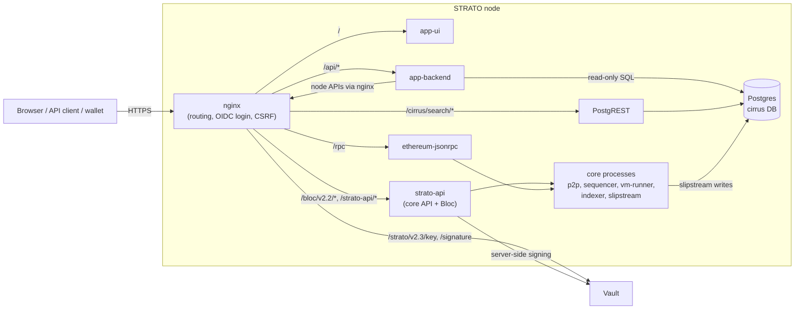

# System Architecture

How a STRATO node serves apps: request routing, how transactions and indexed data flow, the platform contracts, and the security model. For the source-level view, see [Contributor Architecture](../contribute/architecture.md).

## Request Path

Every STRATO node runs the same stack. nginx is the single public entry point. It routes each path to the app, the core APIs, Cirrus or JSON-RPC.



Two routing details:

- **app-backend calls the node back through nginx.** Inside the node it uses `NODE_URL=http://nginx:8081`, so it hits the same `/bloc/v2.2`, `/strato-api/eth/v1.2` and `/cirrus/search` routes as external clients.
- **Vault is a separate service.** Nodes use a shared Vault by default. With `--localAuth`, the node runs its own Vault.

## Components

### nginx

nginx is the edge proxy (OpenResty with lua-resty-openidc). It handles:

- **Login:** OAuth2/OIDC. Browsers use the authorization-code flow; API clients send a bearer token.
- **CSRF protection** on browser routes.
- **Rate limiting** on transaction simulation.
- **JSON-RPC guarding:** it blocks STRATO-specific methods on public `/rpc`.

### App UI and backend

- **app-ui** is a Vite/React single-page app, served at `/`.
- **app-backend** is an Express/TypeScript API, served at `/api/*`. Interactive docs are at `/api/docs` (see [App API](api.md)). The backend has no database of its own. It does the following:
    - reads indexed contract data from Cirrus, both through PostgREST and through a read-only Postgres connection
    - reads node metadata from `/strato-api/eth/v1.2/metadata`
    - builds transactions and submits them through Bloc, or returns them unsigned for wallet signing
    - proxies RPC calls to supported external chains at `/api/rpc/{chainId}` (used by the UI's external-chain wallet connections and bridge flows)

### strato-api

strato-api serves two APIs:

- **Core API** at `/strato-api/eth/v1.2/*`: accounts, blocks, transactions, receipts, storage, metadata. It also accepts already-signed transactions.
- **Bloc API** at `/bloc/v2.2/*`: contract-level calls, server-side signing, unsigned transaction building and simulation.

See [Core Platform API](strato-node-api.md).

### JSON-RPC

`/rpc` serves the standard Ethereum JSON-RPC methods and is on by default. STRATO extension methods (`strato_*`) are blocked on public `/rpc` unless the node runs with `--publicStratoRpc`. See [JSON-RPC](json-rpc.md).

### Cirrus

Cirrus is three parts:

- **slipstream** indexes contract state and events into the Postgres `cirrus` database.
- **PostgREST** exposes that database read-only at `/cirrus/search/*`.
- **The `cirrus` database** holds the data. Tables are named after contracts.

See [Cirrus](cirrus.md).

### Core processes

The core processes are native binaries on the node host:

- `ethereum-discover` and `strato-p2p`: networking
- `strato-sequencer`: PBFT ordering and commit
- `vm-runner`: SolidVM execution
- `strato-indexer` and `slipstream`: indexing

They pass events through embedded JLog streaming.

### Dashboard

The STRATO Management Dashboard is served at `/smd/`. Its backend, apex, serves `/apex-api/*` and the node `/health` endpoint.

### Off-node services

These run outside the node's compose stack:

- bridge relayer
- price oracle
- rewards poller
- tracking-link service
- Highway file server
- the shared Vault

## API Surfaces

| Path | Served by | Access |
|------|-----------|--------|
| `/` | app-ui | Public |
| `/api/*` | app-backend | OIDC session (browser) or bearer token; CSRF on browser sessions; some endpoints allow anonymous access |
| `/bloc/v2.2/*` | strato-api (Bloc) | Reads allowed anonymously. `POST /transaction` and `/transaction/parallel` require login and are signed with the user's Vault key. `POST /transaction/simulate` is rate-limited. |
| `/strato-api/eth/v1.2/*` | strato-api (core API) | Permissionless: reads, plus submitting already-signed transactions |
| `/strato/v2.3/key`, `/strato/v2.3/signature` | Vault | User key and signing operations |
| `/cirrus/search/*` | PostgREST | GET only |
| `/rpc` | ethereum-jsonrpc | Public; `strato_*` extensions blocked unless `--publicStratoRpc` |
| `/smd/`, `/apex-api/*`, `/health` | smd, apex | Dashboard and health status |

## Data Flow

### Transaction signed by the platform (custodial)

1. The user acts in the UI, which calls an `/api/*` endpoint.
2. The backend builds the contract calls and posts them to `/bloc/v2.2/transaction/parallel`, passing along the user's access token.
3. strato-api signs with the user's key held in Vault. The user's key is created on first authenticated use.
4. The sequencer orders the transaction into a block through PBFT consensus.
5. vm-runner executes the block with SolidVM. The fee is charged through the Decider contract (see [Transactions and Fees](../platform/transactions-and-fees.md)).
6. slipstream writes the resulting contract state and events to the `cirrus` database.
7. The UI refreshes: the backend reads the new state from Cirrus, and transaction results come from Bloc.

### Transaction signed by a wallet (self-custody)

1. The backend builds the transactions but returns them unsigned instead of submitting them.
2. The wallet signs them. Supported wallets are the STRATO wallet extension, MetaMask and WalletConnect.
3. The signed transaction goes to `/api/rpc/submit`, which forwards it to `/strato-api/eth/v1.2/transaction`. Wallets can also submit directly with `eth_sendRawTransaction` on `/rpc`.
4. Execution and indexing then proceed as in the custodial flow.

See [Identity and Vault](../platform/identity-and-vault.md).

### Indexing

```
committed block → vm-runner (SolidVM) → contract state + events
                                          │
                                          ▼
                              slipstream → Postgres "cirrus" DB → PostgREST (/cirrus/search)
                                                              └→ app-backend (read-only SQL)
```

Cirrus is updated after blocks are committed and executed, so indexed data can briefly lag the chain head.

## Smart Contracts

The platform contracts live in `app/contracts/concrete/`. They are written in Solidity syntax and run on SolidVM. For deployed addresses, see [Contract Addresses](../build-apps/contract-addresses.md).

| Area | Main contracts | Purpose |
|------|----------------|---------|
| Tokens | `Token`, `TokenFactory`, `TokenMetadata` | ERC20 tokens created through the factory. Transfers revert on failure instead of returning `false`. Tokens are pausable. |
| Pools | `Pool`, `PoolFactory`, `StablePool`, `PoolV3`, `PoolV3Factory`, `PositionManagerV3`, `DirectMintPSM` | Constant-product AMM pools, stable pools, concentrated-liquidity (V3) pools, direct-mint PSM |
| Lending | `LendingPool`, `LiquidityPool`, `CollateralVault`, `LendingRegistry`, `PoolConfigurator`, `RateStrategy`, `PriceOracle`, `SafetyModule` | Supply and borrow, collateral, interest rates, prices. The safety module holds USDST and issues sUSDST. |
| CDP | `CDPEngine`, `CDPVault`, `CDPRegistry`, `CDPReserve` | Collateralized debt positions that mint USDST; the reserve holds USDST fees |
| Bridge | `MercataBridge`, `StratoNativeBridge`, `StratoNativeCustodyVault`, `CreditCardTopUp` | Deposits and withdrawals between STRATO and external EVM chains; separate lifecycle for STRATO-native assets |
| Savings and vaults | `SaveUSDSTVault`, `YieldVault`, `Vault`, `VaultFactory` | USDST savings vault; ERC-4626 yield vault; multi-asset vault |
| Rewards | `Rewards` | Activity-based rewards, fed by the rewards poller |
| Vouchers | `Voucher`, `PayFeesWithVoucher` | Fee vouchers |
| Metals | `MetalForge` | Metal token minting |
| NFTs | `NFT`, `NFTFactory` | ERC-721 tokens |
| Flash | `FlashMint` | Flash-minting |
| Staking | `StratoStaking`, `ValidatorRegistry`, `StratoStakingV2`, `ValidatorRegistryV2`, `FeeRouter` | Validator staking and fee routing |
| Governance and admin | `AdminRegistry`, `MercataGovernance`, `FeeCollector` | Admin voting, the validator set, protocol fee collection |
| Users | `UserRegistry` | On-chain user identities |
| Upgrades | `Proxy` | Delegatecall proxy: storage stays in the proxy while the logic contract can be replaced |

Some contracts are pre-deployed in the genesis block. Their sources are in `strato/core/strato-genesis/resources/strato/`:

- `Decider` / `DeciderState`: transaction fees
- `MercataGovernance`: the validator set
- `UserRegistry`
- `FeeRouter`

### Ownership and admin control

The deployment (`BaseCodeCollection.sol`) transfers ownership of platform contracts to **AdminRegistry**. Examples include `FeeCollector`, `TokenFactory`, `PoolFactory` and `LendingRegistry`.

AdminRegistry controls owner-only functions in two ways:

- **Admin voting.** An admin calls `castVoteOnIssue(target, function, args)`, which opens an issue or votes on an existing one. The call executes once the votes reach a threshold. The threshold is set per target and function, or falls back to a default. It is expressed in basis points of the admin count.
- **Whitelist.** A whitelisted `(target, function, caller)` entry lets a specific non-admin account execute that function directly. For example, `FlashMint` is whitelisted to mint and burn USDST.

Several contracts, including `Pool`, `StablePool` and `YieldVault`, use reentrancy guards. `Token`, `Vault`, `YieldVault` and `SaveUSDSTVault` are pausable.

## Security Model

### Authentication

- **Identity provider:** OAuth2/OIDC. By default this is Keycloak at `keycloak.blockapps.net` (realm `mercata`). A node started with `--localAuth` uses bundled Ory Hydra and Kratos instead.
- **Enforcement:** nginx validates logins and tokens. Browsers get a session protected by CSRF checks; API clients send bearer tokens.
- **On-chain identity:** usernames map to user contracts through `UserRegistry`. There are no X.509 certificates.

### Keys and signing

- **Custodial:** the Vault holds user keys, and Bloc signs transactions server-side for logged-in users.
- **Self-custody:** users sign in their own wallet, and the backend only builds unsigned transactions.

### Data access

- Cirrus is read-only: PostgREST accepts only GET, and the backend's Postgres connection is read-only.
- Postgres (5432) and Redis (6379) are published on 127.0.0.1 only. strato-api (3000) binds to the Docker bridge address on Linux (`172.17.0.1`) and to localhost elsewhere.
- `ethereum-jsonrpc` (8545) listens on all host interfaces, so keep 8545 closed in your firewall and use nginx's `/rpc` route. Only nginx (HTTP/HTTPS) and the p2p port (30303 TCP/UDP) should be reachable from outside. See [Node requirements](../node/requirements.md).

### Fees and consensus

- **Fees:** every transaction pays a fee through the Decider contract. See [Transactions and Fees](../platform/transactions-and-fees.md).
- **Consensus:** blocks are ordered by PBFT (blockstanbul) among the validator set recorded in `MercataGovernance`. The default block period is 1000 ms. See [Consensus](../platform/consensus.md).

## Monitoring

- **Metrics:** each node runs Prometheus. It scrapes `strato-sequencer`, strato-api, `strato-p2p`, `vm-runner`, `slipstream`, the process monitor, apex and nginx (`prometheus-packager/strato_prometheus.yml`). No alerting rules ship with the node.
- **Logs:** native processes and containers write to the node's `logs/` directory. `strato-logrotate` rotates them.
- **Health:** `strato-ps` shows node status, and `/health` (apex) reports health over HTTP.

See [Node Operations](../node/operations.md).

## Deployment

- **Nodes** are built from source and started with `strato-up`. Each node runs the same stack, including the app UI and backend and the dashboard. See [Run a Node](../node/index.md).
- **Networks:** `upquark` is the production mainnet and `helium` is the public testnet. See [Networks](../platform/networks.md).
- **Separate deployments:** the shared Vault, Highway file server, bridge relayer, oracle, rewards poller and tracking service run outside the node.
- **CI:** builds and tests run in Jenkins (`pipelines/`). See [Contributing](../contribute/contributing.md#continuous-integration).

## Related Docs

- [App API](api.md): DeFi operations API
- [Core Platform API](strato-node-api.md): core API and Bloc
- [Cirrus](cirrus.md): indexed contract data
- [JSON-RPC](json-rpc.md): Ethereum-compatible RPC
- [Contributor Architecture](../contribute/architecture.md): source layout and processes
- [E2E Examples](../build-apps/e2e.md): complete application examples
