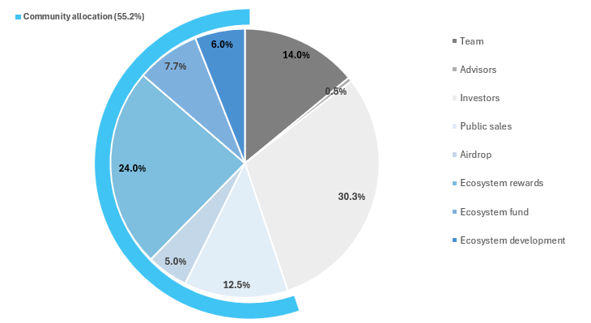
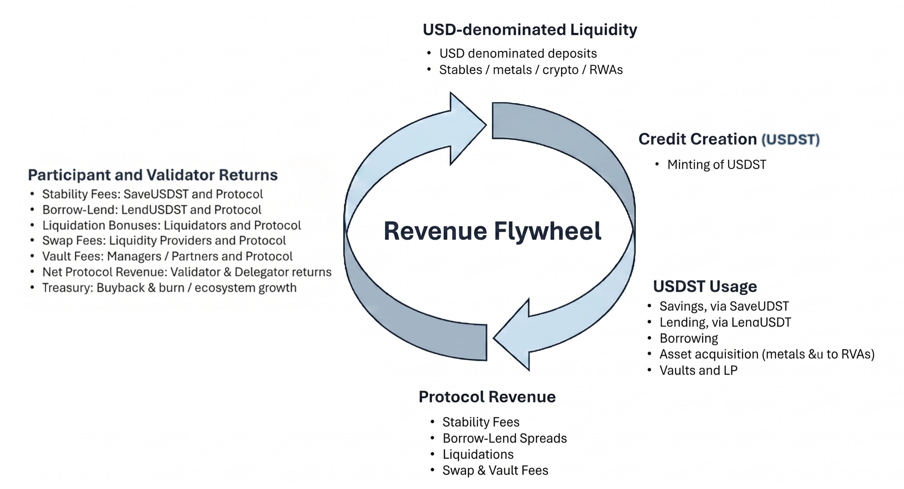

# $STRATO Tokenomics

$STRATO is the utility token of STRATO, an app-chain in the Ethereum ecosystem for tokenizing gold, silver, and other real-world assets for DeFi. The token has three jobs: pay for gas on the network, secure the network through staking, and grant certain privileges to borrowers.

---

## Token at a Glance

| Property | Value |
|---|---|
| **Ticker** | $STRATO |
| **Max supply** | 100,000,000 (fixed) |
| **Circulating at TGE** | 21.7% |
| **Community allocation** | 55.2% of total supply |
| **Network** | STRATO |

---

## Token Utilities

STRATO is a utility token for the network. It pays for gas, secures the network through staking, and gives holders a say in how the protocol runs.

**Gas.** $STRATO pays for transaction fees on the network. Gas fees go to the protocol. Network activity creates demand for the token, and governance sets gas parameters over time.

**Staking and security.** Validators stake $STRATO to produce blocks, validate transactions, and secure the network, earning rewards for doing so. Holders who do not run a node can delegate their $STRATO to a validator and share in those rewards.

**Early staking and validation.** Anyone with 1,000 $STRATO or more is eligible for early staking, earning more $STRATO before the TGE. Validators will need a minimum of 10,000 $STRATO to run a node and earn rewards before the TGE.

**Borrowing benefits.** Holding $STRATO lowers the stability fees borrowers pay when minting USDST, alongside other holder benefits. The discount tracks your wallet balance, with no staking required.

**Governance.** $STRATO holders govern the protocol through stake-weighted voting on parameters, treasury allocation, and ecosystem priorities. Control moves progressively toward full on-chain tokenholder governance as the network matures.

---

## Token Allocation

The community share (pre-TGE sales, airdrop, ecosystem rewards, ecosystem fund, ecosystem dev) makes up the majority of supply.

| Category | Allocation | At TGE |
|---|---|---|
| Team | 14.0% | 0% |
| Advisors | 0.5% | 0.1% |
| Investors | 30.3% | 0% |
| Pre-TGE sales | 12.5% | 12.5% |
| Airdrop | 5.0% | 5.0% |
| Ecosystem rewards | 24.0% | 0.2% |
| Ecosystem fund | 7.7% | 3.8% |
| Ecosystem dev | 6.0% | 0% |

---

## STRATO Revenue Flywheel

The protocol generates revenue from credit and liquidity activity, and captures part of that revenue.

The flow runs like this:

1. Users deposit USD-denominated collateral (metals, RWAs, stables, and crypto).
2. They mint USDST against that collateral, creating credit.
3. USDST gets used across the ecosystem: savings, lending, borrowing, asset acquisition, and liquidity provision.
4. That activity generates protocol revenue.
5. Revenue flows to validators and to the treasury.
6. Staking, gas, and fee discounts create ongoing demand for $STRATO, drawing more liquidity into the system.

